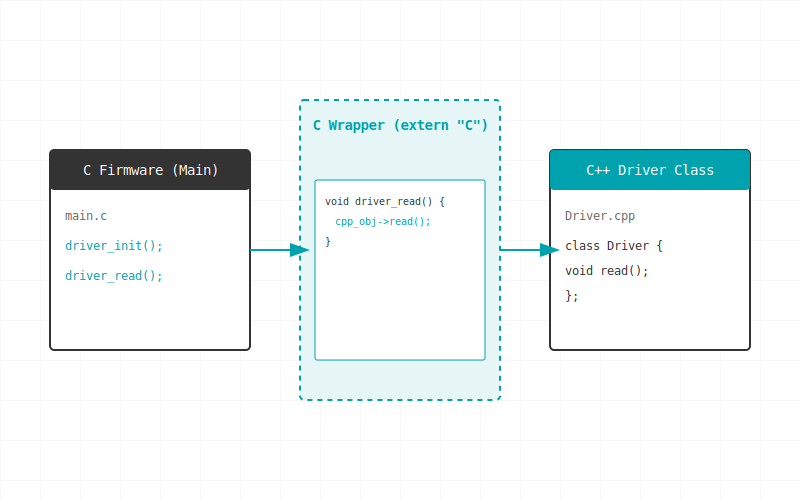

## Why & How to Wire a C++ Sensor Driver into Your C Firmware

Imagine this scenario: you’re deep into building out an IoT framework. Your C firmware is stable, the networking protocols are humming, and everything is on track. Then, someone spots a new temperature sensor that’s 10x cheaper and more accurate than your current one. 

Team wants it integrated immediately. You download the official driver, only to discover a major catch: it's written entirely in C++. Your core firmware is C. ESP-IDF and modern build systems support both, so surely it just works, right?

Sometimes it does. Often it doesn't — and when it fails, the error messages are cryptic enough to send you down a two-hour rabbit hole. 

You *could* rewrite the driver in C, but that's a massive time sink. Instead, here is how to bridge the gap and drop that C++ driver straight into your C codebase.

## Why the Mismatch Happens: Name Mangling

C and C++ handle symbols differently under the hood. In C, a function called `sensor_init` becomes the symbol `sensor_init` in the compiled object file. 

In C++, that same function becomes something like `_Z11sensor_initv`. This is called **name mangling**, and C++ uses it to support features like function overloading. When your C code tries to call a C++ function, the linker looks for the plain `sensor_init` symbol, finds `_Z11sensor_initv` instead, and throws a linkage error.

## The Fix: `extern "C"`

The universal solution is the `extern "C"` linkage specifier. It tells the C++ compiler to use C-style naming (no mangling) for the wrapped declarations. 

Depending on your architecture, there are two practical patterns for implementing this.

### Pattern 1: The "Opaque Pointer" Wrapper (Best for Multiple Instances)

C compilers have absolutely no concept of C++ classes. To get the two languages talking, we use an **opaque pointer** (`void*`). This allows us to hold onto a C++ class instance inside our C code without ever exposing the complex internal structure of that class.

**1. The Bridge Header (`TempSensor_C_Wrapper.h`)**
This is the only file your C code will ever see. The `#ifdef __cplusplus` guards ensure that C++ compilers disable name mangling, while C compilers just see standard C functions.

```c
#pragma once

#ifdef __cplusplus
extern "C" {
#endif

// The Opaque Pointer: C doesn't know what this points to, and it doesn't care.
typedef void* TempSensorHandle; 

TempSensorHandle TempSensor_create(int i2c_address);
void TempSensor_destroy(TempSensorHandle sensor);
int TempSensor_init(TempSensorHandle sensor);
float TempSensor_getTemperature(TempSensorHandle sensor);

#ifdef __cplusplus
}
#endif
```

**2. The Bridge Implementation (`TempSensor_C_Wrapper.cpp`)**
Compiled as C++, this file translates the simple C functions into the actual C++ object creation and method calls by casting the opaque pointer back to the class type.

```cpp
#include "TempSensor.hpp" // The vendor's C++ driver
#include "TempSensor_C_Wrapper.h"

extern "C" {
    TempSensorHandle TempSensor_create(int i2c_address) {
        return new TempSensor(i2c_address);
    }

    void TempSensor_destroy(TempSensorHandle sensor) {
        delete static_cast<TempSensor*>(sensor);
    }

    int TempSensor_init(TempSensorHandle sensor) {
        return static_cast<TempSensor*>(sensor)->init() ? 1 : 0;
    }

    float TempSensor_getTemperature(TempSensorHandle sensor) {
        return static_cast<TempSensor*>(sensor)->getTemperature();
    }
}
```

### Pattern 2: The Static Pointer (Best for Single Peripherals like in ESP-IDF)

If you only ever have one instance of this sensor (common in ESP-IDF projects), you can skip the opaque pointer and manage a static C++ instance directly behind the `extern "C"` wall.



**1. The Wrapper Implementation (`sensor.cpp`)**

```cpp
#include "sensor.h" // Contains your extern "C" declarations
#include "MyDriverClass.hpp"

// Hold the instance internally
static MyDriverClass *driver = nullptr;

extern "C" {
    void sensor_init(void) {
        driver = new MyDriverClass();
        driver->begin();
    }

    int sensor_read(float *temperature, float *humidity) {
        if (!driver) return -1;
        *temperature = driver->getTemperature();
        *humidity    = driver->getHumidity();
        return 0;
    }

    void sensor_deinit(void) {
        delete driver;
        driver = nullptr;
    }
}
```

Your C firmware can now just call `sensor_init()` and `sensor_read(&temp, &hum)` like any standard C function.

## Build System Integration

To make this compile, you need to tell your build system to compile the C++ files correctly and link them.

**Standard CMake (`CMakeLists.txt`)**
```cmake
add_library(TempSensorLib STATIC TempSensor.cpp TempSensor_C_Wrapper.cpp)
add_executable(firmware main.c)
target_link_libraries(firmware PRIVATE TempSensorLib)
```

**ESP-IDF Setup**
In ESP-IDF, you must explicitly tell CMake which files are C++ so they get compiled with `g++` instead of `gcc`. In your component's `CMakeLists.txt`:

```cmake
idf_component_register(
    SRCS
        "sensor.cpp"       # C++ file
        "main.c"           # C file
    INCLUDE_DIRS "."
)

# Force CMake to treat sensor.cpp as C++
set_source_files_properties(sensor.cpp PROPERTIES LANGUAGE CXX)
```

## Embedded-Specific Gotchas

When bringing C++ into constrained environments, keep an eye out for these traps:

* **Handling Exceptions (ESP-IDF):** By default, ESP-IDF disables C++ exceptions to save code space. If your C++ driver uses `try/catch`, you must enable them in `sdkconfig` via `CONFIG_COMPILER_CXX_EXCEPTIONS=y`. Alternatively, wrap exception-throwing code inside your `extern "C"` wrapper and convert them to C-friendly error codes.
* **Static Initialization Order:** C++ global objects (constructed before `main()`) have an undefined initialization order across translation units. In embedded systems, this can mean a peripheral gets used before its hardware is initialized. Avoid global C++ objects with complex constructors. Use pointers initialized explicitly in an `init()` function (as shown in Pattern 2).
* **The Brute Force Alternative:** You *can* tell your compiler to treat all `.c` files as C++ (e.g., passing `-x c++`). **Do not do this.** C allows implicit `void*` conversions and has different keyword rules. Compiling a massive C codebase as C++ is a nuclear option that will likely generate hundreds of errors.

## The Golden Rule

Keep the C/C++ boundary as thin as possible. Write a clean C API in `extern "C"` wrappers, hide the C++ complexity behind that wall, and let your C firmware remain blissfully unaware of the class hierarchy on the other side. The thinner the boundary, the fewer surprises.

> Stay tuned & Be Curious!