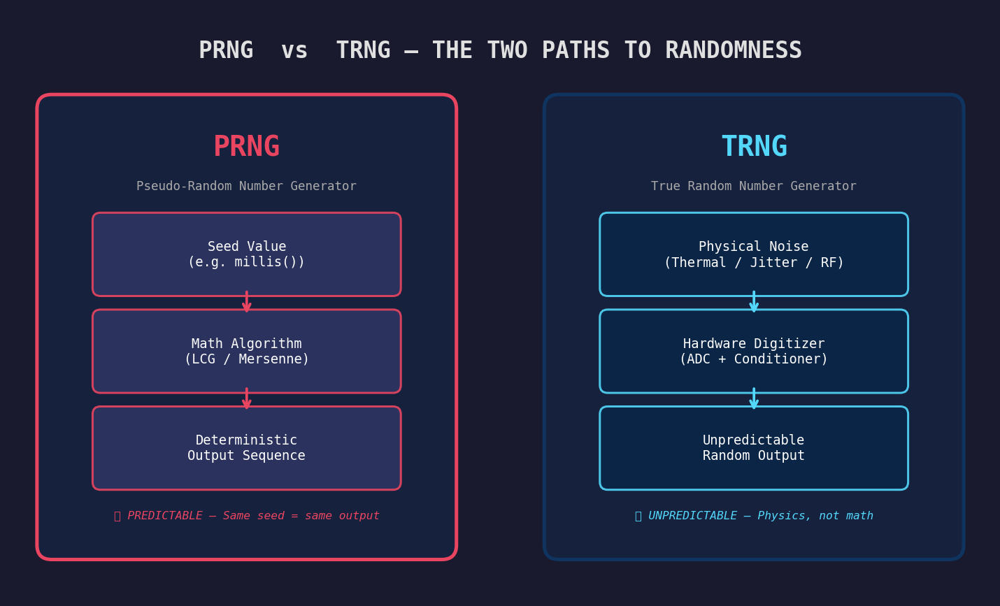
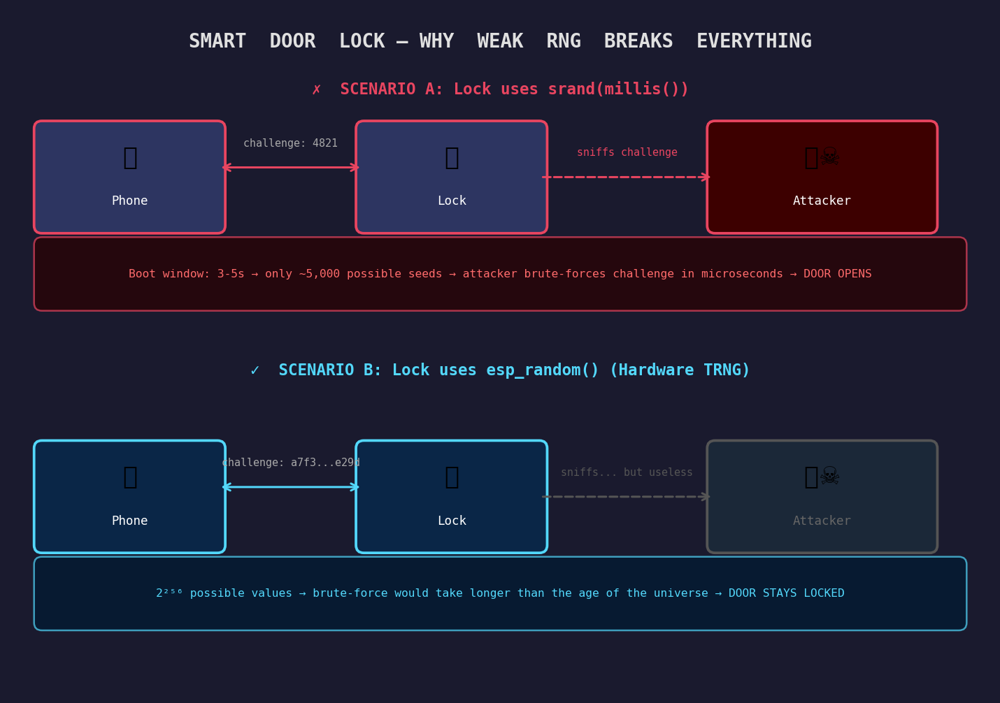
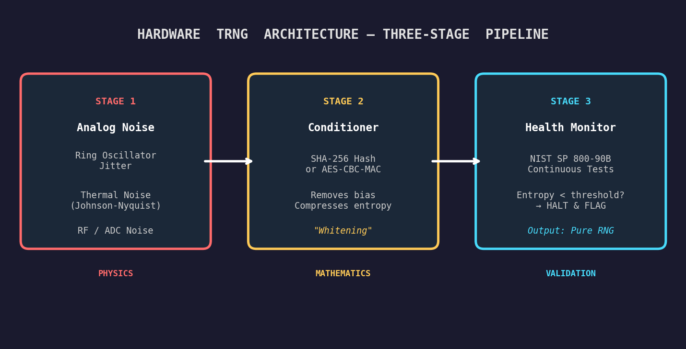
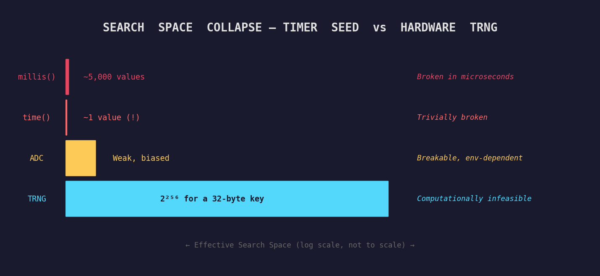
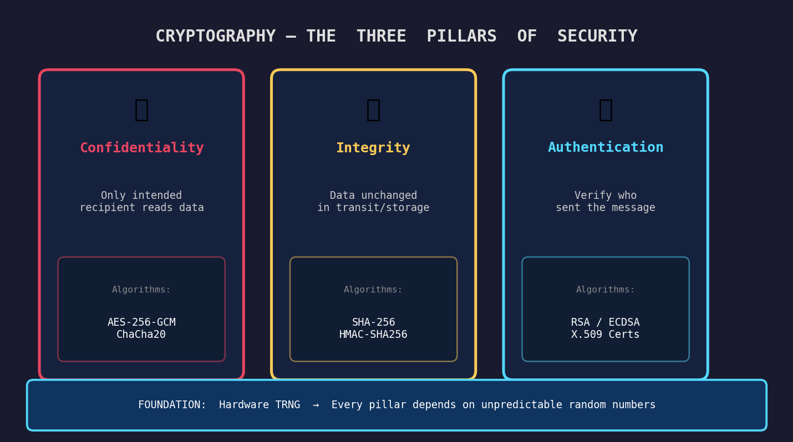
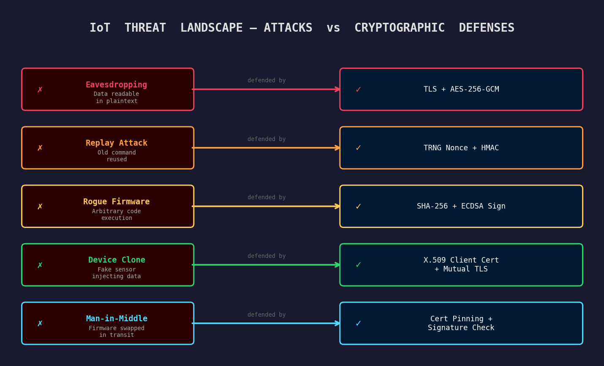
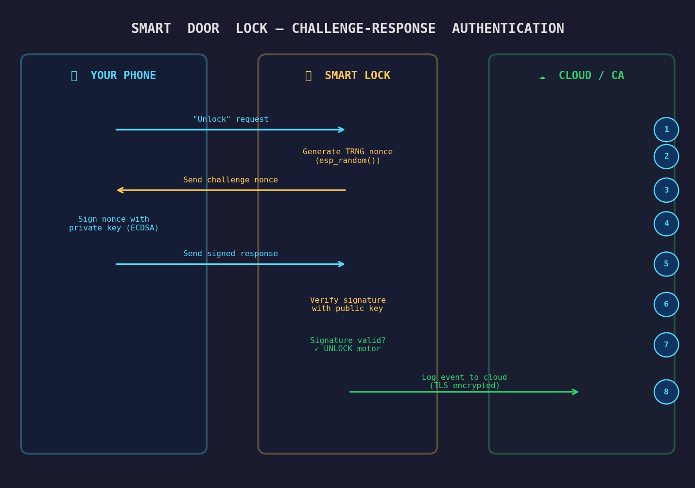
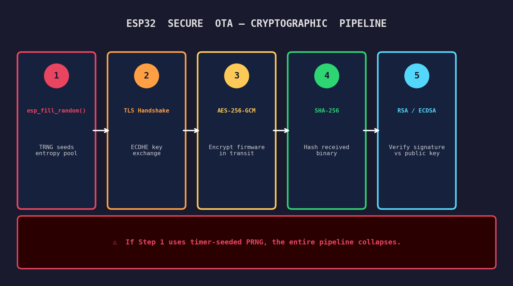

# RNG, True Randomness, and Why Cryptography Needs Hardware Entropy

Your ESP32 is generating a session key right now. It will use that key to encrypt every byte it sends to your cloud backend. The entire security of that connection, and every device connected to it, depends on one question: *where did that key come from?*

If the answer is `srand(millis())`, you have a problem.

Let's break this down.


## What is RNG?

RNG stands for **Random Number Generation**, any method a system uses to produce a number that cannot be predicted before it is generated. Simple idea, surprisingly hard to do correctly.

Computers are **deterministic machines**. Give them the same input and they produce the same output, every time. This is great for reliability, but it fundamentally conflicts with the requirement for randomness. A processor has no internal concept of "chance." Left to its own devices, it will just count.

There are two fundamentally different ways to get a number that behaves randomly:

**Pseudo-Random Number Generation (PRNG)** is a mathematical algorithm that produces a sequence of numbers that *look* random but are entirely computed from a starting value called a *seed*. The same seed always produces the same sequence (without exception). The randomness is an illusion. `rand()`, `random()`, Mersenne Twister, LCG, these are all PRNGs.

**True Random Number Generation (TRNG)** uses a physical, unpredictable phenomenon from the real world as its source: thermal noise in a resistor, the precise timing drift between two independent clock oscillators, or the quantum path of a photon. These events cannot be predicted, not because the math is complex, but because the universe itself doesn't predetermine them.

>[!TIP] **Analogy:** Imagine a vending machine that always gives you chips when you press B3. That's deterministic: a PRNG. A truly random vending machine would give you chips, then a drink, then chips again, with no pattern you or anyone else could predict in advance. That's TRNG.



The distinction matters enormously in practice:

| Property | PRNG | TRNG |
| --- | --- | --- |
| **Source** | Math formula | Physical noise |
| **Reproducible?** | Yes (given seed) | Never |
| **Predictable?** | Yes (with seed + algorithm) | No |
| **Speed** | Very fast | Slower (hardware limited) |
| **Use case** | Games, simulations, tests | Key generation, nonces, IVs |

For most applications (generating random map layouts, shuffling a deck of cards, Monte Carlo simulations), a PRNG is perfectly fine. For anything security-related, it is not.


## Why True RNG Matters in Embedded Systems

An embedded system is a small, purpose-built computer inside a device. Your thermostat, your smart lock, your industrial pressure sensor, your ESP32 IoT node running in a factory ceiling. These devices are not sitting safely behind a corporate firewall. They are often physically accessible, always connected, running unattended, and increasingly controlling things with real-world consequences, like motors, valves, doors, and medical equipment.

When these devices communicate over a network, they need to prove their identity, protect the data they transmit, and defend against commands being replayed or forged. All of these security mechanisms ultimately depend on random numbers that cannot be guessed.

### The Smart Door Lock: A Real-World Example

Let's walk through a concrete example that makes the stakes visceral: a **Bluetooth smart door lock** that talks to your phone.

To prevent **replay attacks**, where an attacker records your "unlock" command and plays it back later, the lock issues a fresh **challenge number** with every authentication attempt. Your phone signs that number with your private key. The lock verifies the signature. Different challenge every time, so a recorded unlock command is useless.

Here's where RNG decides whether this system is a fortress or a cardboard box.

**Scenario A: The lock uses `srand(millis())`**

The lock boots up and reaches the key generation call within 3–5 seconds. The seed is the uptime in milliseconds, one of approximately 3,000 to 5,000 values. An attacker who knows this (and it's not hard to figure out: just watch the power-on LED) can iterate all possible seeds in microseconds on any modern laptop. They reconstruct the challenge, forge a valid response, and the lock opens.

The AES-256 encryption protecting the Bluetooth channel is completely irrelevant. The weakness was upstream, in the RNG.

**Scenario B: The lock uses `esp_random()` (hardware TRNG)**

The challenge is a 256-bit value derived from ring oscillator jitter and RF thermal noise. There are 2^256 possible values, a number so large that brute-forcing it would take longer than the age of the universe on every computer ever built, running in parallel.

Same lock. Same encryption algorithm. Same Bluetooth protocol. The only difference is *where the challenge number came from*.



### The Smart Door Lock Vulnerability: A Case Study in RNG Failures

#### Overview
A standard security measure for smart locks is the **Challenge-Response system**, designed to prevent replay attacks. Instead of sending a static "unlock" code (which can be easily recorded and repeated by a hacker), the lock issues a brand-new, random challenge every time an unlock is requested. The user's phone mathematically signs this random challenge using a secret private key, and the lock verifies it. 

**The Core Dependency:** If implemented correctly, a recorded unlock command is useless because the challenge changes every time. However, this entire fortress relies entirely on the strength of the **Random Number Generator (RNG)**.

#### The Flaw: Predictable "Randomness"
Microcontrollers are purely logical machines; they cannot generate truly random numbers natively. Instead, they use **Pseudo-Random Number Generators (PRNGs)**—mathematical formulas that spit out sequences of numbers that *look* random. 

These formulas require a starting number, called a **seed**. The golden rule of PRNGs is:
> **If you provide the exact same seed, the formula will generate the exact same sequence of numbers.**

##### The Fatal Code: `srand(millis())`
A common, fatal mistake in embedded firmware is seeding the RNG with the device's uptime in milliseconds upon booting:
```c
srand(millis()); 
```
When the lock boots up, it takes a predictable amount of time to initialize—usually between 3 and 5 seconds. This means the seed will almost always be a value between **3,000 and 5,000**. This completely destroys the randomness, reducing an infinite pool of possibilities to just a couple thousand predictable options.

---

#### Anatomy of the Attack

An attacker does not need to guess your private key or break complex cryptography. Because the lock's behavior is predictable, they simply trick the system into accepting an "old answer."

**Phase 1: The Harvest**
The attacker hides nearby with a basic Bluetooth sniffer and waits for the legitimate owner to unlock the door.
1. **The Wake-up:** As you approach, the lock wakes up (e.g., at exactly 3.4 seconds, setting its seed to `3400`).
2. **The Challenge:** Because the seed is `3400`, the lock issues a specific mathematical challenge: **Challenge A**.
3. **The Response:** Your phone securely signs it and replies with the correct answer: **Response B**.
4. **The Capture:** The attacker records this exchange. They now know that if the lock asks for **Challenge A**, the winning ticket is **Response B**.

**Phase 2: Forcing History to Repeat**
The next day, the attacker approaches the lock alone.
1. **The Reboot:** The attacker forces the lock to restart (via a power surge, magnet, or triggering deep sleep).
2. **The Timing:** The attacker waits exactly 3.4 seconds, mimicking the exact boot time from yesterday.
3. **The Predictable Seed:** The lock checks `millis()`, sees 3,400 milliseconds, and sets its seed to `3400` once again.
4. **The Repeat:** Because the seed is exactly the same, the lock's mathematical formula repeats itself. It issues the exact same "random" number: **Challenge A**.

**Phase 3: The Bypass**
The lock is now waiting for the cryptographic signature for **Challenge A**. 
1. **The Replay:** The attacker simply broadcasts their recording from yesterday: **Response B**.
2. **The Verification:** The lock's internal computer checks the math. **Response B** is indeed the perfect cryptographic signature for **Challenge A**.
3. **The Theft:** The lock assumes whoever sent **Response B** must possess the private key, and the door opens.

---

#### Why AES-256 Encryption Doesn't Help
Think of **AES-256** as an incredibly thick, indestructible armored pipe connecting the phone to the lock. The attacker did not break this pipe. 

Because the lock's random number generator was entirely predictable, the attacker was able to obtain a perfectly valid, mathematically correct "Open the Door" command. The attacker simply established their own secure, armored pipe to the lock and sent the stolen, valid command through it. 

**The Verdict:** The encryption did its job perfectly by securely delivering the message. The critical failure was upstream: the lock's predictable brain couldn't tell the difference between a fresh conversation and a recorded one.





This is not a hypothetical scenario. In 2010, Sony's PlayStation 3 was completely broken because their ECDSA signature implementation used a **constant value** where a random nonce was required. From just two signed messages, researchers solved for the private key using simple algebra[^1]. The entire platform security collapsed, not because of weak cryptography, but because of a single bad random number.

### What TRNG is Required For

- **Key generation**: private keys, symmetric session keys, pre-shared keys
- **Nonce and IV generation**: anti-replay tokens, AES initialization vectors
- **Challenge–response authentication**: device-to-device and device-to-server handshakes
- **TLS session establishment**: the `ClientHello` random field in a TLS handshake
- **OTA firmware signing**: generating the random material that goes into signing operations


## Hardware Requirements for Generating True RNG

Because TRNG requires a source of physical unpredictability, it requires dedicated hardware to harvest it. You can't fake physics in software. Here is what that looks like in practice.



### Stage 1: Physical Noise Sources

#### Ring Oscillator Jitter

The most common TRNG source in SoCs. Two independent clock oscillators run at slightly different, and thermally unstable, frequencies. The tiny, unpredictable phase drift between them is sampled repeatedly and XORed or hashed into an entropy pool. The ESP32 uses this as a primary entropy source. The jitter is genuinely random because it is driven by quantum-level thermal fluctuations in the silicon itself.

> [!TIP] **Analogy:** Imagine two people clapping in a room, each trying to maintain a steady rhythm but with slightly different tempos. The exact moment one clap overlaps with the other is unpredictable; that overlap is the "jitter" a TRNG harvests.

#### Thermal Noise (Johnson–Nyquist Noise)

Every resistor, at any temperature above absolute zero, generates a small random voltage across its terminals due to the thermal agitation of electrons. This noise is amplified, digitized, and fed into an entropy accumulator. It is the most fundamental physical noise source and is used in many dedicated TRNG chips.

#### RF and ADC Noise

The ESP32 can read noise from its Wi-Fi RF front-end when the radio is active. The received signal strength indicator (RSSI) sampling and the least-significant bits of ADC conversions both contribute low-level, environment-dependent noise that supplements the oscillator jitter.

This is why Espressif's documentation recommends enabling Wi-Fi or Bluetooth *before* calling `esp_fill_random()` for high-security use cases, as the RF subsystem dramatically improves entropy quality[^2].

#### Avalanche Noise

A reverse-biased p-n junction, when driven into avalanche breakdown, produces a burst of chaotic current fluctuations. The timing and amplitude of individual avalanche events is fundamentally quantum-mechanical and cannot be predicted. Dedicated TRNG chips from Maxim, Microchip, and others use this source, offering extremely high entropy rates.

#### SRAM Power-On State

When SRAM powers up, each memory cell randomly settles to either 0 or 1 before software writes to it. This settling is driven by manufacturing process variations and thermal noise, making the pattern unique to each specific chip and boot event. Used as a source of boot-time entropy and, in some systems, as a device fingerprint.

### Stage 2: The Conditioner (Randomness Extractor)

Raw analog data from the noise source often exhibits statistical bias, such as slightly more 1s than 0s, for example, due to manufacturing imperfections. The conditioner "whitens" this data, completely eliminating biases and compressing fractional entropy into full, pure entropy.

Modern TRNGs achieve this by passing the raw physical noise through cryptographic hashing functions, such as SHA-256 or AES-CBC-MAC, before outputting the final random number to software[^3].

### Stage 3: Continuous Health Monitoring

Physical analog circuits are delicate. They can degrade over years of operation, be influenced by extreme temperature swings, or be maliciously manipulated by an attacker attempting to starve the chip of voltage. International security standards (NIST SP 800-90B, German AIS-31) mandate that the TRNG hardware continuously execute real-time statistical health tests[^4].

If the hardware detects that the entropy level has dropped below a safe threshold, the system immediately flags an error to prevent software from generating weak cryptographic keys.

### Using TRNG on ESP32

The ESP32 exposes its hardware RNG through the `esp_random()` and `esp_fill_random()` APIs in ESP-IDF. The hardware RNG register sits at address `0x3FF75144`. Internally, it is continuously seeded by ring oscillator jitter and RF noise.

```c
#include "esp_random.h"

void generate_session_key(uint8_t *key_buf, size_t key_len) {
    // Hardware TRNG: RF noise + ring oscillator jitter
    // Wi-Fi or BT should be initialized before this call for best entropy
    esp_fill_random(key_buf, key_len);
}

void generate_nonce(uint32_t *nonce) {
    *nonce = esp_random();  // single 32-bit hardware random value
}
```

The hardware RNG is not a CSPRNG (Cryptographically Secure PRNG) by itself, as it is raw entropy. For protocol-level operations, mbedTLS (which ships with ESP-IDF) wraps `esp_fill_random()` as its entropy source and feeds it into a CSPRNG (CTR-DRBG by default) before use in TLS operations.

### STM32 vs ESP32: TRNG Implementation Compared

| Feature | STM32 (e.g. STM32L5, H7) | ESP32 |
| --- | --- | --- |
| **Primary Entropy** | Multiple ring oscillators | ADC thermal noise + RF noise |
| **Digitization** | Ring oscillator outputs XORed together | ADC bit streams XORed as seeds |
| **Conditioning** | Dedicated LFSR (separate clock domain) | Seeds mbedTLS CTR-DRBG (AES-256) |
| **Dependencies** | Just enable the RNG clock | RF (Wi-Fi/BT) must be active for full entropy |
| **Fallback Behavior** | Health test flags + interrupt on failure | Silently degrades to PRNG if RF is off |
| **Compliance** | NIST SP 800-90B certified (128-bit min) | Developer-dependent; use with mbedTLS |

The critical ESP32 gotcha: **if both Wi-Fi and Bluetooth are disabled to save power, the hardware RNG loses its physical entropy source and silently degrades to pseudo-random output.** The API doesn't warn you. Your code still compiles and runs. But your "random" numbers are no longer truly random[^2].


## Why Software Timer–Based RNG is Not Recommended for Cryptography

The most common RNG mistake in beginner firmware is using the system clock or uptime as the random seed:

```c
// BAD: never do this for keys, nonces, or any security-sensitive value
srand(millis());
uint32_t key = rand();
```

This looks reasonable at a glance. The timer value changes constantly, right? The problem is that *the value is not secret*. It is not even hard to guess.

### The Attack Surface

**Bounded search space.** If a device consistently boots and reaches the key generation call within a 3–5 second window, the seed is one of approximately 3,000–5,000 values. An attacker can iterate all of them in microseconds on any modern CPU. A 32-bit AES key that was generated this way offers not 2^32 = 4 billion possible values, but effectively ~5,000, a reduction of six orders of magnitude.

**Known boot timing.** Many embedded devices have deterministic firmware initialization sequences. An attacker who can observe the first MQTT publish timestamp, the first TLS handshake, or even just the device's power-on LED can narrow the seed range further.

**Seeding from `time(NULL)`.** Unix epoch time is public information. If the device's clock is synchronized via NTP, the attacker knows the second the key was generated. The entire 32-bit seed space collapses to a handful of values around that timestamp.

**LCG is not cryptographically secure.** Even with a strong seed, standard C `rand()` uses a Linear Congruential Generator. Given any consecutive output, the internal state and all future outputs can be calculated analytically. It was designed for statistical uniformity, not unpredictability[^5].



### The Boot-Time Entropy Hole

The problem gets even worse during device initialization, a well-documented vulnerability called the **boot-time entropy hole**[^6].

When an embedded device first powers on, the OS kernel tries to build an entropy pool from system events (interrupt timings, network packets, and user inputs). But during the very early boot, *none of these things are happening*. Hardware interrupts may not be enabled, the network interface hasn't negotiated a connection, and there is no human interaction.

If the device generates a cryptographic key during this window, such as an SSH host key or a device certificate, it draws from an entropy pool that is virtually empty.

Because the boot sequence on identical hardware takes almost exactly the same number of clock cycles every startup (a well-documented vulnerability), **thousands of identical devices deployed in the field will generate identical keys**. If 10,000 smart meters boot under identical low-entropy conditions, they all get the same "unique" identity, and compromising one compromises all of them.

> [!TIP] **Analogy:** Imagine a factory that makes safes, and every safe gets its combination set during the first 3 seconds after power-on. If every safe's electronics boot identically, they all get the *same* combination. That's the boot-time entropy hole.

### Real-World Disasters

**Sony PlayStation 3 (2010):** Sony's ECDSA implementation used a constant nonce instead of a fresh random value for every signature. Two signatures with the same nonce = trivial algebra to recover the private key. The entire PS3 platform security was permanently and irreversibly compromised[^1].

**Debian OpenSSL Bug (2006–2008):** A well-meaning Debian maintainer commented out two lines of code that fed uninitialized memory into OpenSSL's entropy pool, because a debugging tool flagged them as "hazardous." The only remaining entropy source was the process ID (max value 32,768). For two years, every Debian and Ubuntu server worldwide generated SSL keys from a pool of 32,767 possibilities. Attackers pre-computed all of them[^7].

The rule is absolute: **any random number feeding into a cryptographic operation must come from a hardware TRNG or a CSPRNG seeded by one.** There is no exception.


## What is Cryptography?

Cryptography is the science of **protecting information** so that only intended parties can read it, and of **verifying identity** so you can be certain who you are communicating with.

It has existed for thousands of years, starting with Julius Caesar who shifted each letter of his messages by three positions; only recipients who knew the shift could decode them. Modern cryptography replaces letter shifts with mathematical operations that are trivially fast to compute in one direction and computationally infeasible to reverse without the correct key.

> [!TIP] **Analogy:** Imagine sending a letter in a transparent envelope versus a locked metal box. Cryptography is the lock. Even if someone intercepts the box, they cannot read the letter without the key. The math in modern cryptography is sophisticated enough that breaking it without the key would take longer than the age of the universe, even on hardware that does not yet exist.

### The Three Pillars of Security

Cryptography has three core security properties, and you need to understand all three to make sense of how it is used in embedded systems.



**Confidentiality** means that only the intended recipient can read the data. AES-256 in GCM mode encrypts a plaintext message into ciphertext that is indistinguishable from random noise without the key. Intercepting the packet gives you nothing useful.

**Integrity** means that you can detect whether data has been modified in transit or storage. SHA-256 produces a 32-byte fingerprint of any data. If even a single bit is changed, the hash changes completely and unpredictably.

**Authentication** means you can verify who sent a message or who is claiming to be who. Digital signatures (RSA, ECDSA) let a device prove it holds a private key without ever revealing it. X.509 certificates bind a public key to a verified identity.

### Symmetric vs Asymmetric: The Two Types

| Type | How It Works | Example Algorithms | Common Embedded Use |
| --- | --- | --- | --- |
| **Symmetric** | Same key to encrypt and decrypt | AES-128, AES-256, ChaCha20 | Bulk data encryption, NVS encryption |
| **Asymmetric** | Public key encrypts, private key decrypts (or vice versa for signatures) | RSA-2048, ECDSA P-256 | TLS handshake, firmware signing, device certs |
| **Hashing** | One-way deterministic fingerprint | SHA-256, SHA-384, BLAKE2 | Firmware integrity, password hashing |
| **MAC / HMAC** | Hash combined with a secret key | HMAC-SHA256 | MQTT message authentication, API token verification |

These are not alternatives, but rather layers. A typical TLS connection uses asymmetric crypto to exchange keys, symmetric crypto to encrypt the data, and HMAC to verify message integrity, all simultaneously.


## Why Cryptography is Needed in Embedded Systems

Unlike a laptop sitting behind a router and a firewall, your ESP32 sensor node might be mounted to a factory ceiling, physically accessible to anyone with a screwdriver. It's always connected. It has no screen, no keyboard, no user who notices suspicious behavior. And it may be controlling something that matters: a relay, a motor, a valve, a door.

This threat model is fundamentally different from desktop computing.

### The IoT Threat Landscape



Without TLS, every MQTT message your device publishes (sensor readings, commands, tokens) is visible to anyone on the same network or with a passive radio receiver.

**Replay Attacks**: an attacker captures a legitimate "open valve" command and retransmits it later. Without TRNG-generated nonces that expire after one use, the device can't tell the difference.

**Firmware Tampering**: if an attacker can push arbitrary code as a firmware update because OTA lacks signature verification, they own the device entirely. SHA-256 + ECDSA signature checking prevents this.

**Device Impersonation**: a fake sensor presents itself as legitimate. Without client certificates (X.509 provisioned at manufacture), your backend has no way to distinguish it from the real thing.

**Man-in-the-Middle**: an attacker intercepts an OTA update, strips the firmware, and injects a malicious binary. Certificate pinning prevents this even if the attacker has a CA-signed certificate.

### The Smart Lock: Full Authentication Flow

Let's trace the complete authentication flow of our smart door lock to see how all these cryptographic concepts work together in practice.



**Step 1:** Your phone sends an "unlock" request over BLE.

The lock generates a fresh challenge nonce using `esp_random()` (hardware TRNG). This nonce has never been used before and will never be used again.

**Step 3:** The lock sends the challenge nonce back to your phone.

**Step 4:** Your phone signs the nonce with your private key using ECDSA. The private key never leaves your phone's secure enclave.

**Step 5:** Your phone sends the signed response back to the lock.

**Step 6:** The lock verifies the signature using the corresponding public key (stored during initial pairing).

If the signature is mathematically valid, the lock confirms you hold the private key, the nonce is fresh (not a replay), and the message hasn't been tampered with. The motor turns. The door opens.

**Step 8:** The lock logs the event to the cloud backend over a TLS-encrypted connection. The TLS session itself was established using TRNG-seeded entropy.

Every single step in this chain depends on the quality of the random numbers at the foundation. Replace `esp_random()` with `rand()` at step 2, and the entire chain collapses.

### The Crypto Pipeline in a Secure ESP32 OTA Update

A complete HTTPS OTA update chains several cryptographic operations together, each depending on the previous:



1. **`esp_fill_random()`** seeds the TLS entropy pool via mbedTLS's CTR-DRBG
2. **TLS Handshake** uses ECDHE for key exchange (ephemeral keys protect forward secrecy)
3. **AES-256-GCM** encrypts the firmware download in transit
4. **SHA-256** hashes the received binary to verify integrity
5. **RSA or ECDSA signature** over the hash is verified against the server's public key embedded in flash

If step 1 uses a timer-seeded PRNG instead of hardware TRNG, the entropy fed into the TLS handshake is weak. An attacker who can predict the session key can decrypt the download channel, substitute malicious firmware, and generate their own hash for it. The signature check? Bypassed, because the session itself was compromised.

This is why the TRNG requirement is not a detail. It is the foundation.


## The Secure Boot Chain of Trust

One of the most critical applications of cryptography in modern microcontrollers is the **Secure Boot** process: the mechanism that ensures your device only runs authentic, unmodified firmware[^8].

**Step 1: Boot ROM.** The very first code that executes on power-on is etched into read-only silicon during manufacturing. It cannot be modified by any software attacker.

**Step 2: Hardware Trust Anchor.** The Boot ROM looks for the manufacturer's public key, permanently burned into One-Time Programmable (OTP) eFuses. An attacker cannot replace this key.

**Step 3: Cryptographic Verification.** Before loading the bootloader from flash, the Boot ROM runs SHA-256 over the entire file and verifies the ECDSA digital signature against the eFuse public key.

**Step 4: Chain Propagation.** If the signature is valid, the bootloader loads and repeats the verification for the OS kernel, which verifies the application.

If any file has been tampered with, even by a single bit, the hash changes, the signature fails, and the device refuses to boot. The attack is neutralized before malicious code ever executes.

This entire lifecycle (Secure Boot, flash encryption keys, and TLS sessions) relies on unguessable random numbers at every step.


## Summary

| Concept | What It Is | Why It Matters |
| --- | --- | --- |
| **PRNG** | Math-based sequence from a seed | Fine for games. Never use for cryptographic keys. |
| **TRNG** | Physics-based randomness from hardware noise | Required for all security-sensitive random number generation. |
| **Entropy** | Measure of unpredictability in a random source | More entropy = harder to predict = more secure. |
| **Timer seed** | Using `millis()` or `time()` as a PRNG seed | Predictable and attackable. Reduces key space to thousands of guesses. |
| **Cryptography** | Mathematical tools for confidentiality, integrity, and authentication | The only scalable defense against network-level IoT attacks. |
| **IoT crypto stack** | TLS, AES, SHA-256, HMAC, X.509 on constrained devices | Prevents eavesdropping, replay attacks, firmware tampering, and device impersonation. |

>[!NOTE] **The Golden Rule:** Every random number feeding into a cryptographic operation, such as key generation, nonce creation, IV selection, or session tokens, must come from a hardware TRNG or a CSPRNG seeded by one. A single weak RNG collapses the security of the entire system, regardless of how strong AES or RSA is on top of it.

Random numbers are not a footnote in embedded security. They are the starting point. Get them wrong and everything downstream, including the cipher, the protocol, and the certificate chain, becomes a very expensive decoration on top of a broken foundation.


## References
[^1]: Fail0verflow, "PS3 Epic Fail," 27th Chaos Communication Congress (27C3), 2010: the ECDSA constant-nonce attack that broke PlayStation 3 platform security

[^2]: Espressif Systems, "System: ESP-IDF Programming Guide: Random Number Generation," https://docs.espressif.com/projects/esp-idf/en/stable/esp32/api-reference/system/random.html

[^3]: National Institute of Standards and Technology, "NIST SP 800-90A Rev. 1: Recommendation for Random Number Generation Using Deterministic Random Bit Generators," https://csrc.nist.gov/publications/detail/sp/800-90a/rev-1/final

[^4]: National Institute of Standards and Technology, "NIST SP 800-90B: Recommendation for the Entropy Sources Used for Random Bit Generation," https://csrc.nist.gov/publications/detail/sp/800-90b/final

[^5]: Bernstein, D.J. & Lange, T., "Non-uniform cracks in the concrete: The power of free precomputation," ASIACRYPT 2013

[^6]: UCSD, "Welcome to the Entropics: Boot-Time Entropy in Embedded Devices," https://cseweb.ucsd.edu/~kmowery/papers/earlyentropy.pdf

[^7]: CITP Princeton, "The Debian OpenSSL Bug: Backdoor or Security Accident?" https://blog.citp.princeton.edu/2013/09/20/software-transparency-debian-openssl-bug/

[^8]: Espressif Systems, "ESP32 Technical Reference Manual: Section 24 - Random Number Generator," https://www.espressif.com/sites/default/files/documentation/esp32_technical_reference_manual_en.pdf
