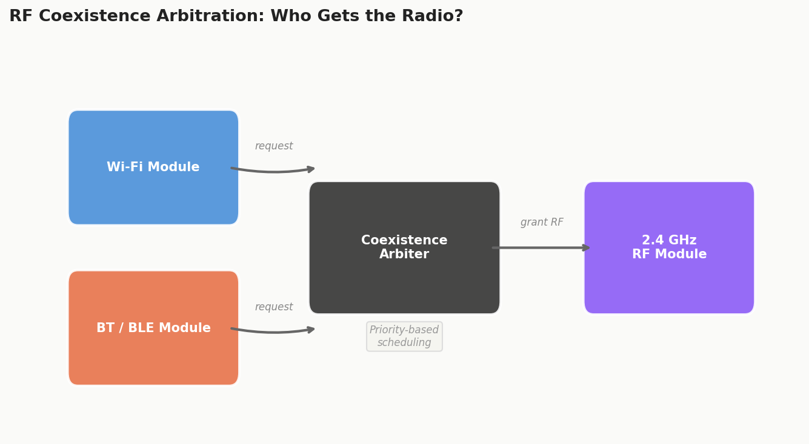
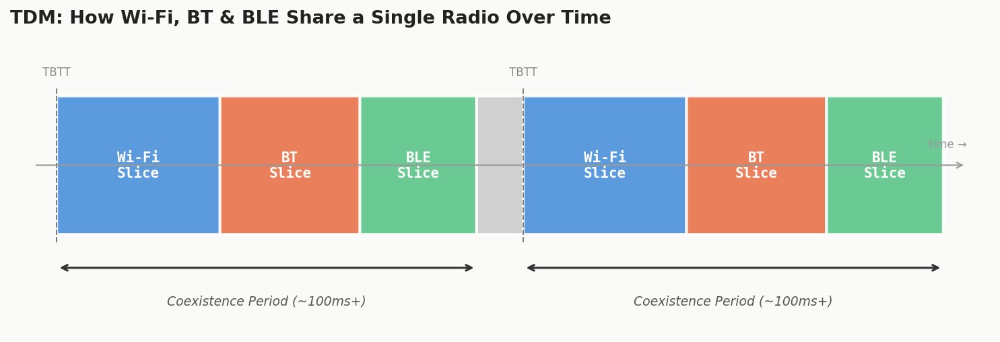
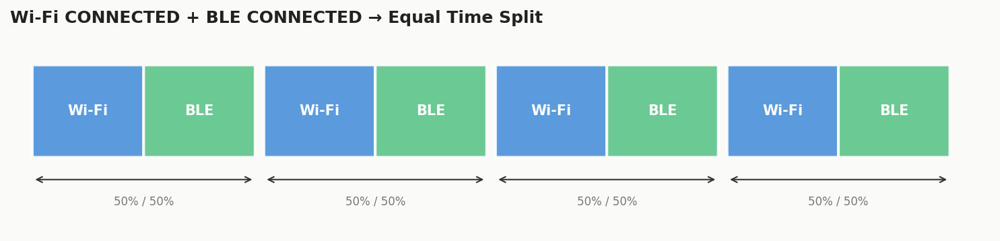
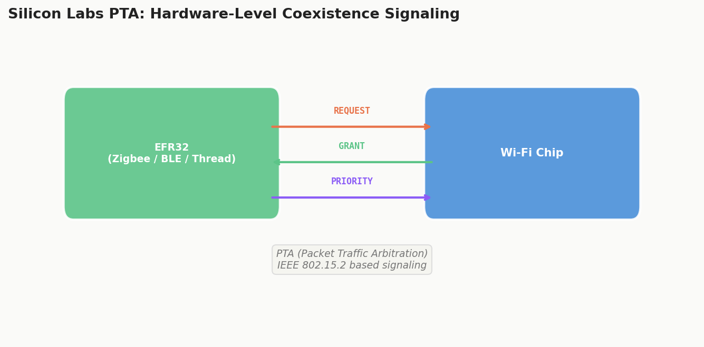

Ever wondered how your ESP32 manages to run Wi-Fi *and* Bluetooth *at the same time*, with just one radio? There's no magic. No second antenna hiding under the hood. It's all about **time division multiplexing (TDM)**, a surprisingly elegant trick where the chip takes turns, really fast, between protocols.

Let's break this down.


## The Problem: One Radio, Many Mouths to Feed

Here's the thing: the ESP32 (and many other IoT SoCs) has a **single 2.4 GHz RF module**. That's it. One radio for Wi-Fi, one for classic Bluetooth, one for BLE. Except... it's all the same one.

Wi-Fi, BLE, Zigbee, Thread, they all live in the **2.4 GHz ISM band**. When you tell your ESP32 to scan for Wi-Fi networks *and* advertise over BLE at the same time, you're essentially asking one mouth to eat two meals simultaneously.

It can't. So it **takes turns**.

That's TDM in a nutshell. The radio rapidly switches between protocols, giving each one a **time slice** to transmit or receive. If it's done fast enough, it *feels* simultaneous to the user. Your BLE sensor keeps reporting, your Wi-Fi connection stays alive, and nobody notices the juggling act happening underneath.


## How ESP32 Actually Does It

Espressif's documentation[^1] spells it out clearly:

> *"ESP32 has only one 2.4 GHz ISM band RF module, which is shared by Bluetooth (BT & BLE) and Wi-Fi, so Bluetooth can't receive or transmit data while Wi-Fi is receiving or transmitting data and vice versa. Under such circumstances, ESP32 uses the time-division multiplexing method to receive and transmit packets."*

### The Coexistence Arbiter

At the core of this is a **coexistence arbitration module**. Think of it like a traffic cop at a busy intersection. Both Wi-Fi and Bluetooth constantly raise their hands saying *"I need the radio!"*, and the arbiter decides who gets it based on **priority**.



The arbiter doesn't just flip a coin. It uses a **priority-based scheduling system** that adapts to what's happening in real time.

### The Time Slicing Strategy

A **coexistence period** gets divided into three time slices, always in this order:

1. **Wi-Fi slice**: Wi-Fi gets highest priority here
2. **BT slice**: Classic Bluetooth takes over
3. **BLE slice**: BLE gets its turn



During each slice, that protocol's requests get **higher priority** in the arbiter. So if BLE tries to jump in during the Wi-Fi slice, Wi-Fi usually wins. But there are exceptions (more on that in a second).

The actual duration and split of these slices changes based on what Wi-Fi is doing:

| Wi-Fi Status | What Happens |
|---|---|
| **IDLE** | Bluetooth module handles its own coexistence freely |
| **CONNECTED** | Period starts at TBTT (Target Beacon Transmission Time), lasts >100ms |
| **SCANNING** | Wi-Fi gets a longer slice (it needs more airtime to hop channels) |
| **CONNECTING** | Wi-Fi slice expands to ensure the handshake completes |

When both Wi-Fi and BLE are in **CONNECTED** state, the period gets split **50/50** between them, fair and square:



### Dynamic Priority: The Plot Twist

Here's where it gets interesting. Priorities aren't fixed. They're **dynamic**.

Take BLE advertising as an example. Out of every N advertising events, one is flagged as **high priority**. If that high-priority event happens to land inside the Wi-Fi time slice? BLE can **preempt** Wi-Fi and grab the radio.

This is crucial for BLE reliability. You can't just starve Bluetooth of airtime because Wi-Fi is busy downloading a firmware update. The system needs to be smarter than that, and it is.


## Beyond ESP32: How Silicon Labs Handles It

Now, Espressif's approach is a **software-based** TDM solution: one chip, one radio, time-slicing in firmware. But what happens when you have **multiple physical radios** in the same device? Like an IoT gateway with separate Wi-Fi, Zigbee, and BLE chips all crammed into a small PCB?

This is where Silicon Labs' approach[^2] comes in, and it's a different beast.

### The PTA (Packet Traffic Arbitration) Approach

Instead of one radio taking turns with itself, Silicon Labs implements **managed coexistence** using a hardware signaling protocol based on **IEEE 802.15.2**. It's called **Packet Traffic Arbitration (PTA)**[^4].

The idea: the EFR32 (Silicon Labs' Zigbee/Thread/BLE SoC) physically signals the Wi-Fi chip before it needs to transmit or receive. The Wi-Fi chip then **backs off**, delaying its own transmission so the EFR32 can get a clean window.



This works over **1, 2, or 3 wire connections** between the chips:

- **REQUEST**: *"Hey Wi-Fi, I need to send something"*
- **GRANT**: *"Go ahead, I'll wait"*
- **PRIORITY**: *"This is urgent, give me the channel NOW"*

It's like two people sharing a walkie-talkie, but with a polite protocol for who talks when. Implemented at the **MAC layer**, it's been tested with major Wi-Fi chip vendors and works across Zigbee, Thread, and Bluetooth.


## Two Philosophies, Same Goal

Let's zoom out for a second. There are really **two fundamental approaches** to multiprotocol coexistence on 2.4 GHz:

| Approach | How It Works | Used By | Best For |
|---|---|---|---|
| **Software TDM** | Single radio, time-sliced in firmware | ESP32, Nordic nRF, many single-chip SoCs | Cost-sensitive, space-constrained devices |
| **Hardware PTA** | Multiple radios, coordinated via GPIO signals | Silicon Labs EFR32 + Wi-Fi combos, multi-chip gateways | High-throughput gateways and hubs |

Both are valid. Both have trade-offs.

Software TDM is **simpler** and **cheaper** (one radio = less BOM cost), but you're fundamentally limited by the fact that only one protocol can use the radio at any given instant. If Wi-Fi is blasting a large TCP transfer, your BLE connection intervals might get delayed.

Hardware PTA gives you **true parallel operation** (the radios are physically separate), but at the cost of more PCB space, more power, and the complexity of routing those PTA signal wires.


## The Practical Stuff: Making Coexistence Work on ESP32

If you're building something with ESP32 that uses both Wi-Fi and BLE (which, let's be honest, is most IoT projects these days), here are the things that actually matter:

### 1. Enable the Coexistence Module

It's not on by default. In `menuconfig`:

```
Component config → Wi-Fi → Software controls WiFi/Bluetooth coexistence
```

Set `CONFIG_ESP_COEX_SW_COEXIST_ENABLE` to **enabled**. Without this, you're flying blind, as the radio will be a free-for-all.

### 2. Pin Tasks to Different Cores

The ESP32 has two cores. Use them:

- **Wi-Fi protocol stack** → one core
- **Bluetooth controller + host stack** → the other core

This is configured via:
- `CONFIG_BTDM_CTRL_PINNED_TO_CORE_CHOICE`
- `CONFIG_BT_BLUEDROID_PINNED_TO_CORE_CHOICE` (or NimBLE equivalent)
- `CONFIG_ESP_WIFI_TASK_CORE_ID`

This doesn't affect RF scheduling (that's still TDM), but it ensures the **software processing** for each stack doesn't block the other.

### 3. Watch Your BLE Scan Windows

During coexistence, BLE scanning *will* get interrupted by Wi-Fi. If Wi-Fi releases the radio before the BLE scan window ends, BLE needs to quickly grab it back. Enable:

```
CONFIG_BTDM_CTRL_FULL_SCAN_SUPPORTED
```

This lets BLE re-acquire RF resources within the same scan window after Wi-Fi steps aside.

### 4. Don't Mess with Default Power-Save Params

Espressif's docs have a subtle but important warning: if you customize Wi-Fi connectionless power-save parameters (Window and Interval), it can cause Wi-Fi to request RF access **outside its normal time slice**. This wrecks Bluetooth performance.

Unless you've done extensive coexistence testing with custom parameters, **stick to the defaults**.


## What Can Go Wrong?

Let's be real. Coexistence isn't perfect. Here's what you might hit:

- **BLE connection drops during heavy Wi-Fi traffic**: the BLE connection supervision timeout fires because BLE couldn't get enough airtime. Increase the supervision timeout or reduce Wi-Fi throughput during critical BLE operations.

- **Wi-Fi throughput tanks when BLE is active**: you're splitting a 100ms window. If BLE has a lot to say (mesh networking, for example), Wi-Fi gets less time. That's physics, not a bug.

- **SoftAP mode + BLE has unstable performance**: Espressif marks this as "C1" (supported but unstable) in their compatibility matrix. If you need rock-solid SoftAP + BLE, test thoroughly.

- **Sniffer mode and BLE don't mix well**: also C1. The sniffer needs uninterrupted RF access to capture packets, which conflicts with BLE's time slices.


## The Bigger Picture: Why This Matters

We're heading toward a world where every IoT device speaks multiple protocols. Your smart home hub needs Wi-Fi for cloud connectivity, Thread for device mesh, BLE for commissioning, and maybe Zigbee for legacy devices. **All on 2.4 GHz.**

The devices that win aren't the ones with the most radios. They're the ones with the **smartest coexistence**[^3]. Whether that's ESP32's software TDM arbiter or Silicon Labs' hardware PTA system, the core idea is the same: share the airwaves intelligently, give each protocol what it needs, and make the user think everything is running simultaneously.

Because at the end of the day, nobody cares about your time-division multiplexing implementation. They just want their lightbulb to respond when they tap the app.

And that's the mark of good engineering: **when the hard stuff is invisible**.

## References

[^1]: Espressif Systems, "RF Coexistence: ESP-IDF Programming Guide v5.1.1," [https://docs.espressif.com/projects/esp-idf/en/v5.1.1/esp32/api-guides/coexist.html](https://docs.espressif.com/projects/esp-idf/en/v5.1.1/esp32/api-guides/coexist.html)

[^2]: Silicon Labs, "Wi-Fi Coexistence Learning Center," [https://www.silabs.com/wireless/wi-fi/wi-fi-coexistence](https://www.silabs.com/wireless/wi-fi/wi-fi-coexistence)

[^3]: DSR Corporation, "Getting Started with Wireless Coexistence in IoT," [https://dsr-iot.com/news/IoT-coexistence-solutions/](https://dsr-iot.com/news/IoT-coexistence-solutions/)

[^4]: Silicon Labs, "UG103.17: Wi-Fi Coexistence Fundamentals," [https://www.silabs.com/documents/public/user-guides/ug103-17-wi-fi-coexistence-fundamentals.pdf](https://www.silabs.com/documents/public/user-guides/ug103-17-wi-fi-coexistence-fundamentals.pdf)
