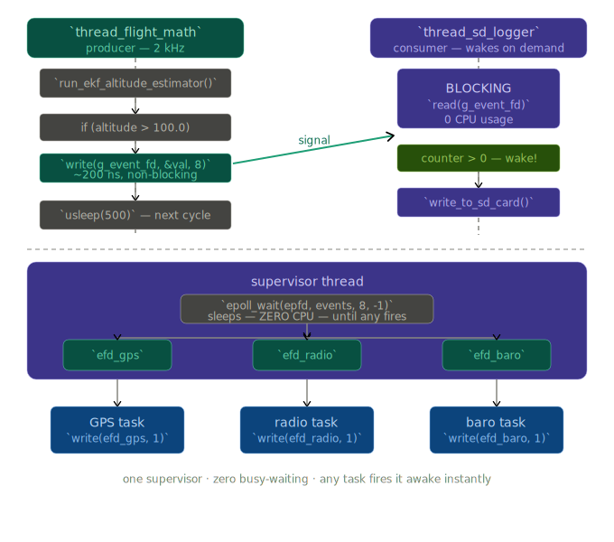

## Taming the Chaos: A Practical Guide to Concurrency in Embedded C

When you are building a flight controller for a drone, your microcontroller has to juggle a lot. It's reading gyroscope data `thousands of times a second`, updating motor speeds, and logging telemetry to an SD card — all seemingly at the exact same time.

If these independent threads try to talk over each other, your drone crashes. Here is the full concurrency toolbox we use to keep the system flying safely.

---

## 1. The Mutex & Lock Ordering

### What is a Mutex?

A `mutex` (from "mutual exclusion") is the most fundamental synchronization primitive. Its job is dead simple: guarantee that only `one thread` can enter a `critical section` of code at a time. Every other thread that tries to enter must wait outside until the first one is done.

> **Real-world analogy:** Picture a single-stall bathroom with one key hanging by the door. If you want to go in, you take the key. Anyone else who shows up while you have the key just waits in the hallway. When you come out, you hang the key back up, and the next person grabs it. The bathroom is your `shared resource` (e.g. a GPS struct). The key is the `mutex`. Taking and returning it is `lock` / `unlock`.

### Why Do You Need One?

In firmware, shared resources are things like `sensor buffers`, `global configuration structs`, or a `UART transmit ring buffer` — any memory that more than one task touches. Without a mutex, `Thread A` might read longitude while `Thread B` is writing the GPS fix halfway through. The read sees a `torn value`: half from the old fix, half from the new one. On a drone, that is enough to send the control law into saturation.

### Mutex Flow Diagram



```
  task_gps_reader                        task_flight_control
  (writer, 5 Hz)                         (reader, 1 kHz)
        │                                       │
        │   parse_nmea_sentence()               │
        │   ┌──────────────────┐                │
        │   │  fresh (local)   │                │
        │   └──────────────────┘                │
        │                                       │
        ▼                                       ▼
  xSemaphoreTake(g_gps_mutex)           xSemaphoreTake(g_gps_mutex)
        │                                       │
        │   ┌── MUTEX LOCKED ─────────────────┐ │
        │   │                                 │ │
        │   │   g_gps_data = fresh  ◄── only  │ │   snap = g_gps_data
        │   │   (safe struct copy)   one at   │ │   (safe struct copy)
        │   │                        a time   │ │
        │   └─────────────────────────────────┘ │
        │                                       │
        ▼                                       ▼
  xSemaphoreGive(g_gps_mutex)           xSemaphoreGive(g_gps_mutex)
        │                                       │
        ▼                                       ▼
  vTaskDelay(200 ms)                    run_pid_controller(&snap)
                                        ▲
                            compute OUTSIDE the lock — never starve!
```




### FreeRTOS Code Example

```c
#include "FreeRTOS.h"
#include "semphr.h"

/* Declare the shared data and its guardian mutex globally */
typedef struct {
    double   latitude;
    double   longitude;
    uint32_t fix_timestamp;
} GPS_Data_t;

static GPS_Data_t        g_gps_data;
static SemaphoreHandle_t g_gps_mutex;

/* Call once at boot */
void gps_init(void) {
    g_gps_mutex = xSemaphoreCreateMutex();
    if (g_gps_mutex == NULL) {
        panic("Out of heap — cannot create GPS mutex");
    }
}

/* Writer task — runs every 200 ms (5 Hz GPS) */
void task_gps_reader(void *params) {
    for (;;) {
        GPS_Data_t fresh = parse_nmea_sentence(); // local, not shared yet

        /* Lock: block for up to 50 ms, then give up */
        if (xSemaphoreTake(g_gps_mutex, pdMS_TO_TICKS(50)) == pdTRUE) {
            g_gps_data = fresh;  // atomic struct copy (all-or-nothing)
            xSemaphoreGive(g_gps_mutex);
        }

        vTaskDelay(pdMS_TO_TICKS(200));
    }
}

/* Reader task — control loop at 1 kHz */
void task_flight_control(void *params) {
    for (;;) {
        GPS_Data_t snap;

        if (xSemaphoreTake(g_gps_mutex, 0) == pdTRUE) {
            snap = g_gps_data;           // safe copy
            xSemaphoreGive(g_gps_mutex);
        }

        run_pid_controller(&snap);
        vTaskDelay(pdMS_TO_TICKS(1));
    }
}
```

Notice that the flight control loop **copies** the GPS data out under the lock, then releases the lock before running the PID controller. Holding a mutex while doing heavy computation is a common mistake — it `starves` other threads. The correct pattern is `lock` → `copy` → `unlock` → `compute`.

### The Deadly Embrace: Deadlock

`Deadlock` happens when two threads each hold a mutex that the other one needs. Neither can proceed. Neither will release what they hold. The system locks up silently — `no crash`, `no error log`, just frozen silence.

> **Analogy:** Alice has the key to Room A and wants the key to Room B. Bob has the key to Room B and wants the key to Room A. They're both standing in the hallway, each waiting for the other. Neither moves. Ever.

### Deadlock Diagram



```
         Thread 1                          Thread 2
             │                                 │
    HOLDS mutex_GPS                    HOLDS mutex_Radio
             │                                 │
             ▼                                 ▼
    WANTS mutex_Radio          WANTS mutex_GPS
             │                                 │
             │         ┌───────────────┐       │
             └────────►│   DEADLOCK    │◄──────┘
                       │               │
                       │  both frozen  │
                       │  forever ☠   │
                       └───────────────┘

  FIX: enforce a global lock order — always GPS before Radio

         Thread 1                          Thread 2 (fixed)
             │                                 │
    TAKE mutex_GPS  ──────────────►   TAKE mutex_GPS   (same order)
             │                                 │
    TAKE mutex_Radio ─────────────►   TAKE mutex_Radio (same order)
             │                                 │
           (work)                           (work)
             │                                 │
    GIVE mutex_Radio              GIVE mutex_Radio
    GIVE mutex_GPS                GIVE mutex_GPS
```




```c
// DEADLOCK — Thread 1 locks GPS then Radio
void task_thread1(void *p) {
    xSemaphoreTake(mutex_GPS,   portMAX_DELAY);
    xSemaphoreTake(mutex_Radio, portMAX_DELAY); // ← hangs if Thread2 holds Radio
    /* ... work ... */
    xSemaphoreGive(mutex_Radio);
    xSemaphoreGive(mutex_GPS);
}

// Thread 2 locks Radio then GPS — opposite order!
void task_thread2(void *p) {
    xSemaphoreTake(mutex_Radio, portMAX_DELAY);
    xSemaphoreTake(mutex_GPS,   portMAX_DELAY); // ← hangs if Thread1 holds GPS
    /* ... work ... */
    xSemaphoreGive(mutex_GPS);
    xSemaphoreGive(mutex_Radio);
}

// FIX — Both threads always lock in the same canonical order: GPS → Radio
void task_thread2_fixed(void *p) {
    xSemaphoreTake(mutex_GPS,   portMAX_DELAY); // GPS first — always
    xSemaphoreTake(mutex_Radio, portMAX_DELAY); // Radio second — always
    /* ... work ... */
    xSemaphoreGive(mutex_Radio);
    xSemaphoreGive(mutex_GPS);
}
```

> [!WARNING]
> **Priority Inversion** is the sneaky cousin of deadlock. A `low-priority` task holds a mutex that a `high-priority` task needs. The high-priority task is stuck waiting — effectively running at the wrong priority. FreeRTOS's `xSemaphoreCreateMutex` implements `priority inheritance` to mitigate this: it temporarily raises the low-priority task's priority while it holds the lock.

### Rules for Safe Mutex Usage

**Rule 1 — Establish a global lock hierarchy.** Assign each mutex a number. Every thread must always acquire mutexes in `ascending numeric order` and release them in `descending order`.

**Rule 2 — Use timed waits, not `portMAX_DELAY`.** Use `xSemaphoreTake(mutex, pdMS_TO_TICKS(100))` instead of blocking forever. If a thread waits longer than expected, log it. Timeouts turn `silent deadlocks` into `debuggable errors`.

**Rule 3 — Minimize lock scope.** Never hold a mutex while calling functions whose lock ordering you don't control — especially third-party libraries, `printf`, or anything that might block on `I/O`.

## 2. Spinlocks for the Need for Speed

### Why Mutexes Fail Inside ISRs

A mutex works by putting a waiting thread to **sleep**. The RTOS scheduler removes it from the run queue and wakes it up later when the lock is free. This `context switch` takes time — typically `2–10 µs` on a `Cortex-M4`.

Inside a hardware `Interrupt Service Routine (ISR)`, sleeping is not an option. An ISR is not a task — it has `no RTOS context` to park. If it tries to take a sleeping mutex, you corrupt the `RTOS scheduler state` and likely trigger a `hard fault`.

Instead, the ISR must **spin**: loop in place, repeatedly checking whether the lock has been released. This is a `spinlock`.

> **Analogy — The Impatient Security Guard:** A mutex-user guard sits down and waits for a buzzer when the logbook is free. A spinlock-user guard just stands there, staring at the logbook, checking every few microseconds — "free yet? free yet?" — burning energy but guaranteeing instant response.

### Spinlock vs Mutex: ISR Context



```
  MUTEX (task context only)          SPINLOCK (ISR + task context)
  ─────────────────────────          ──────────────────────────────

  Thread A tries to lock:            ISR fires, tries to lock:
        │                                  │
        ▼                                  ▼
  ┌─────────────┐                   ┌─────────────┐
  │ lock taken? │                   │ lock taken? │
  └──────┬──────┘                   └──────┬──────┘
     NO  │  YES                        NO  │  YES
         │    │                             │    │
         │    ▼                             │    ▼
         │  SLEEP  ◄── OS removes      loop:│  busy-wait ◄─┐
         │  task from run queue             │  check again  │
         │                                  │  check again  │
         ▼                                  │  check again ─┘
  woken up later                            │
  by xSemaphoreGive                         ▼
  (~2–10 µs overhead)               lock free → enter
                                    (~200 ns, zero OS calls)

  ✅ can sleep          ✅ works in ISR
  ✅ low CPU waste      ✅ deterministic latency
  ❌ cannot use in ISR  ❌ burns CPU while spinning
```




### ESP-IDF Code Example

```c
#include "freertos/FreeRTOS.h"
#include "esp_attr.h"

/* portMUX_TYPE is ESP-IDF's spinlock — backed by a hardware CAS instruction */
static portMUX_TYPE s_packet_spinlock = portMUX_INITIALIZER_UNLOCKED;

static volatile uint32_t s_packet_count = 0;
static volatile uint8_t  s_ring_buf[256];
static volatile uint8_t  s_write_idx = 0;

/* ISR — fires on every received UART byte at up to 115200 baud */
void IRAM_ATTR uart_rx_isr(void *arg) {
    uint8_t byte = read_uart_data_register();

    /* Enter critical section — spins if another core holds the lock */
    portENTER_CRITICAL_ISR(&s_packet_spinlock);

    s_ring_buf[s_write_idx++] = byte; // write to ring buffer
    s_packet_count++;                 // increment shared counter

    /* Exit critical section — release the spinlock */
    portEXIT_CRITICAL_ISR(&s_packet_spinlock);
}

/* Normal task — also uses the same spinlock, disabling preemption */
void task_process_packets(void *params) {
    for (;;) {
        uint32_t count;

        portENTER_CRITICAL(&s_packet_spinlock); // task-context variant
        count = s_packet_count;
        s_packet_count = 0;                     // drain counter atomically
        portEXIT_CRITICAL(&s_packet_spinlock);

        if (count > 0) process_n_bytes(count);
        vTaskDelay(pdMS_TO_TICKS(5));
    }
}
```

> [!WARNING]
> **Never spinlock for long.** If the critical section takes more than `a few dozen microseconds`, you are burning CPU cycles doing nothing useful. On `ESP32`, this also blocks `all other interrupts` on that core. The rule of thumb: spinlocks protect `register-level` operations — a few reads and writes. For anything longer, redesign to avoid shared state.

> [!NOTE]
> **How is a spinlock actually implemented?** Under the hood it uses a `Compare-And-Swap (CAS)` or `Load-Reserved / Store-Conditional (LR/SC)` CPU instruction — a hardware-level atomic read-modify-write that no other core can interrupt. On `ARM Cortex-M`, it is the `LDREX` / `STREX` pair. On `RISC-V`, it is `lr.w` / `sc.w`.

---

## 3. Atomics: Hardware-Level Magic

### The Problem Atomics Solve

Mutexes and spinlocks are powerful, but they carry overhead. For something as simple as a `counter`, a `flag`, or a `pointer swap`, they are overkill. The `C11` `<stdatomic.h>` library exposes a way to tell the hardware: _"make this single operation indivisible."_

Consider a `32-bit` counter on a `16-bit` bus MCU (some `AVR` or older `STM32` variants). Incrementing it requires `two bus cycles`: first update the `lower 16 bits`, then the `upper 16 bits`. If an interrupt fires between those two cycles and reads the counter, it sees a `torn value` — lower half updated, upper half stale. That is a `data race`.

> **Analogy — The Sealed Vote Envelope:** Without atomics it is like counting cards off a deck while someone else simultaneously adds cards to the other end — you might count some twice or miss some. An atomic read is like sealing the deck in an envelope: while you count, no one can touch it. The seal takes `nanoseconds`, not the `microseconds` of a full mutex lock.

### The Torn Read Problem (Without Atomics)



```
  32-bit counter on a 16-bit bus — increment() is NOT atomic:

  Thread writes upper 16 bits:   [ 0x0001 | ????  ]  ← half updated
         ↕  interrupt fires HERE
  ISR reads the counter:         [ 0x0001 | 0x0000 ]  ← torn value!
         ↕  interrupt returns
  Thread writes lower 16 bits:  [ 0x0001 | 0x0001 ]  ← now complete

  ISR saw 0x00010000 instead of 0x00000000 or 0x00010001 — data race!

  With _Atomic uint32_t:

  atomic_fetch_add(&counter, 1)
         │
         ▼
  ┌────────────────────────────────────────────┐
  │  ONE indivisible hardware instruction      │
  │  LOCK XADD / LDADD / LDREX+STREX loop     │
  │                                            │
  │  read ──► modify ──► write                 │
  │   └──────────────────────┘                 │
  │         no interrupt can land here         │
  └────────────────────────────────────────────┘
         │
         ▼
  counter is always consistent — no torn reads, no locks needed
```





### stdatomic.h Code Example

```c
#include <stdatomic.h>
#include <stdint.h>

/* ── Declare atomics. The _Atomic qualifier is the key word. ── */
static _Atomic uint32_t  total_packets_sent  = ATOMIC_VAR_INIT(0);
static _Atomic uint32_t  crc_errors_detected = ATOMIC_VAR_INIT(0);
static _Atomic bool      radio_link_up       = ATOMIC_VAR_INIT(false);

/* ── Writer: radio ISR fires ~10,000 times per second ── */
void IRAM_ATTR radio_tx_complete_isr(void *arg) {
    /* atomic_fetch_add: read + add + write as ONE CPU instruction */
    atomic_fetch_add(&total_packets_sent, 1);
}

void IRAM_ATTR radio_crc_error_isr(void *arg) {
    atomic_fetch_add(&crc_errors_detected, 1);
    atomic_store(&radio_link_up, false);  // safe flag write
}

/* ── Reader: telemetry task reads stats — no locks needed ── */
void task_telemetry_log(void *params) {
    for (;;) {
        uint32_t pkts   = atomic_load(&total_packets_sent);
        uint32_t errors = atomic_load(&crc_errors_detected);
        bool     link   = atomic_load(&radio_link_up);

        log_telemetry(pkts, errors, link);
        vTaskDelay(pdMS_TO_TICKS(1000));
    }
}

/* ── CAS (Compare-And-Swap) — advanced atomic pattern ──
   Only update a config pointer if it hasn't changed since we read it.
   Prevents a race where two threads both try to swap the pointer. */
typedef struct { uint32_t rate; uint8_t channel; } RadioConfig_t;

static _Atomic(RadioConfig_t*) g_active_config;

bool try_swap_config(RadioConfig_t *expected, RadioConfig_t *desired) {
    /* Returns true only if g_active_config was still `expected` */
    return atomic_compare_exchange_strong(&g_active_config, &expected, desired);
}
```

### The Atomic API at a Glance

| Function | What it does |
|---|---|
| `atomic_store(&var, val)` | Safe single write |
| `atomic_load(&var)` | Safe single read |
| `atomic_fetch_add(&var, n)` | Read + add + write in one instruction |
| `atomic_fetch_sub(&var, n)` | Read + subtract + write in one instruction |
| `atomic_compare_exchange_strong` | CAS — swap only if value matches expectation |

> [!TIP]
> **Memory ordering matters.** Atomics have a memory order parameter (e.g., `memory_order_seq_cst`, `memory_order_relaxed`). The default `seq_cst` is the safest — it prevents the compiler and CPU from reordering instructions around the atomic. `relaxed` is fastest but only safe for `pure counters` where ordering between operations doesn't matter. On `embedded ARM`, always default to `seq_cst` until you fully understand the memory model.

---

## 4. `eventfd`: The Linux Whisperer

### What is eventfd?

`eventfd` is a `Linux`-specific primitive that bridges the world of `synchronization` and the world of `I/O`. It creates an in-kernel `64-bit` counter that looks exactly like a file. You can `write()` to it to increment the counter, and `read()` from it to atomically read-and-clear the counter. If the counter is `0`, `read()` blocks the thread — effectively putting it to sleep until someone `write()`s.

The key superpower: because it is a `file descriptor`, you can **poll it alongside real I/O** using `select()`, `poll()`, or `epoll()`. One thread can wait on `"new GPS data OR incoming UART OR SD card ready"` — all in a `single blocking call`.

> **Analogy — The Hotel Doorbell Panel:** The concierge (your logging thread) sits at a desk watching a panel of call buttons. Guests (worker threads) press their room button at any time. The concierge does nothing until a button lights up — then instantly knows which room called. `eventfd` is that button panel. `epoll_wait` is the concierge's patient watching. `write()` is a guest pressing their button.

### eventfd Inter-Thread Wakeup



```
  thread_flight_math (2 kHz)              thread_sd_logger
  ──────────────────────────              ─────────────────
        │                                        │
        │  run_ekf_altitude_estimator()          │
        │                                        │  read(g_event_fd)
        │  if (altitude > 100.0):               │  ┌──────────────┐
        │                                        │  │  BLOCKING    │
        │   uint64_t val = 1;                    │  │  (0 CPU use) │
        │   write(g_event_fd, &val, 8)           │  │  waiting...  │
        │   ──── ~200 ns, non-blocking ────►     │  └──────┬───────┘
        │                                        │         │
        │                                        │  counter > 0 → wake!
        │                                        │         │
        │                                        ▼
        │                                 write_to_sd_card()
        │
        ▼
  usleep(500)  [next cycle]


  epoll multiplexing — ONE thread watching MANY eventfds:

  ┌──────────────────────────────────────────────────────┐
  │                  supervisor thread                   │
  │                                                      │
  │   epoll_wait(epfd, events, 8, -1)                    │
  │         │                                            │
  │         │  sleeps here — ZERO CPU — until any fires  │
  │         │                                            │
  │    ┌────┴──────────────────────────┐                 │
  │    │    │              │           │                 │
  │    ▼    ▼              ▼           ▼                 │
  │  efd_gps           efd_radio    efd_baro             │
  │    │                  │           │                  │
  └────┼──────────────────┼───────────┼──────────────────┘
       │                  │           │
  GPS task           radio task   baro task
  write(efd_gps,1)  write(...)   write(...)
```





### Basic Inter-Thread Wakeup

```c
#define _GNU_SOURCE
#include <sys/eventfd.h>
#include <unistd.h>
#include <stdint.h>
#include <pthread.h>
#include <stdio.h>

static int    g_event_fd = -1;
static volatile double g_latest_altitude = 0.0;

/* ── PRODUCER: high-speed math thread (runs at 2 kHz) ── */
void* thread_flight_math(void *arg) {
    for (;;) {
        double altitude = run_ekf_altitude_estimator();
        g_latest_altitude = altitude;

        /* Signal the logger — write 1 to increment the eventfd counter */
        if (altitude > 100.0) {          // only log when flying
            uint64_t val = 1;
            write(g_event_fd, &val, sizeof(val)); // non-blocking, ~200 ns
        }

        usleep(500);  // 2 kHz loop
    }
    return NULL;
}

/* ── CONSUMER: SD card logging thread (wakes on demand) ── */
void* thread_sd_logger(void *arg) {
    for (;;) {
        uint64_t event_count;

        /* read() BLOCKS the thread — zero CPU usage — until write() fires */
        ssize_t n = read(g_event_fd, &event_count, sizeof(event_count));

        if (n == sizeof(event_count)) {
            /* event_count tells us how many signals were batched */
            printf("[LOG] %llu events — altitude=%.2f m\n",
                   event_count, g_latest_altitude);
            write_to_sd_card(g_latest_altitude);
        }
    }
    return NULL;
}

int main(void) {
    /* EFD_SEMAPHORE: each read() returns exactly 1, like a semaphore */
    g_event_fd = eventfd(0, EFD_SEMAPHORE);
    if (g_event_fd < 0) { perror("eventfd"); return 1; }

    pthread_t t1, t2;
    pthread_create(&t1, NULL, thread_flight_math, NULL);
    pthread_create(&t2, NULL, thread_sd_logger,   NULL);
    pthread_join(t1, NULL);
    pthread_join(t2, NULL);
    close(g_event_fd);
    return 0;
}
```

### Multiplexing Multiple Events with epoll

This is where `eventfd` truly shines. One supervisor thread can wait on `GPS`, `radio`, and `barometer` events simultaneously:

```c
#include <sys/epoll.h>
#include <sys/eventfd.h>
#include <unistd.h>

/* Build an epoll set watching three eventfd handles at once */
void thread_supervisor(int efd_gps, int efd_radio, int efd_baro) {
    int epfd = epoll_create1(0);

    struct epoll_event ev = { .events = EPOLLIN };

    ev.data.fd = efd_gps;   epoll_ctl(epfd, EPOLL_CTL_ADD, efd_gps,   &ev);
    ev.data.fd = efd_radio; epoll_ctl(epfd, EPOLL_CTL_ADD, efd_radio, &ev);
    ev.data.fd = efd_baro;  epoll_ctl(epfd, EPOLL_CTL_ADD, efd_baro,  &ev);

    struct epoll_event events[8];

    for (;;) {
        /* Sleeps until ANY eventfd fires — zero CPU waste */
        int n = epoll_wait(epfd, events, 8, -1);
        for (int i = 0; i < n; i++) {
            if (events[i].data.fd == efd_gps)   handle_gps_event();
            if (events[i].data.fd == efd_radio) handle_radio_event();
            if (events[i].data.fd == efd_baro)  handle_baro_event();
        }
    }
}
```

> [!NOTE]
> **`eventfd` vs `pipe` vs POSIX `semaphore`.** A `pipe` could do this too, but uses `two file descriptors` and copies data through a `kernel buffer`. A POSIX `semaphore` can't be used with `epoll`. `eventfd` is a `single FD`, uses `no buffer copy`, and integrates seamlessly with the `Linux I/O event loop` — making it the cleanest choice for inter-thread wakeup on embedded Linux (`Yocto`, `Buildroot`, etc.).

---

## 5. When to Use What — Decision Table

```
  Start here: what are you protecting or signalling?
                           │
           ┌───────────────┼───────────────────┐
           │               │                   │
           ▼               ▼                   ▼
     Single variable    Struct / buffer     Wake another
     (counter, flag,    shared between      thread / task
      pointer swap)     two+ tasks
           │               │                   │
           ▼               ▼                   ▼
       ATOMIC          Does the writer       Linux?
    <stdatomic.h>      come from an ISR?       │
    1–2 CPU cycles           │             ┌───┴────┐
    no locks needed      YES │  NO         │        │
                             │   │        YES       NO
                             ▼   ▼         │        │
                         SPINLOCK MUTEX  eventfd  Semaphore /
                         ~200 ns  2–10µs ~1 µs    Message Queue
                         ISR-safe blocks  epoll    5–20 µs
```


| Primitive | Context | CPU Cost | Latency | Ideal Use Case |
|---|---|---|---|---|
| `Mutex` | Task only | Low (blocks) | `2–10 µs` | Protecting struct/buffer shared between tasks |
| `Spinlock` | Task + ISR | Burns CPU | `~200 ns` | ISR accessing shared ring buffer or counter |
| `Atomic` | Any | Minimal | `1–2 cycles` | Single counters, flags, pointer swaps |
| `eventfd` | Linux tasks | Near-zero wait | `~1 µs` | Inter-thread wakeup + epoll multiplexing |
| `Semaphore` | Task (count) | Low (blocks) | `2–10 µs` | Counting available resources (DMA slots, buffers) |
| `Message Queue` | Task to Task | Medium | `5–20 µs` | Passing typed data between producer and consumer |

> [!NOTE]
> **Takeaway:**
>
> Concurrency isn't about running things at the same time; it's about managing `access` to `shared state`. Each primitive trades off `latency`, `CPU cost`, and `context restrictions` differently. Choose the `lightest tool` that solves your specific problem — in embedded systems, every `CPU cycle` spent waiting is a cycle not running your control loop.
>
> - Counter / flag updated from ISR? → `Atomic`
> - Protecting a struct between tasks? → `Mutex` + copy-out pattern
> - Locking from inside an ISR? → `Spinlock` (`portENTER_CRITICAL_ISR`)
> - Waking a logger/worker thread on Linux? → `eventfd`
> - Multiple mutexes in one task? → Enforce `lock ordering`
> - System freezes with no crash? → Suspect `deadlock`, add timed waits