## Bulletproof Embedded Design: Essential Design Patterns

Writing embedded C code that works on your desk is easy. Writing code that survives `sensor glitches`, `power fluctuations`, and `memory constraints` in the real world is incredibly hard.

Here are the structural design patterns that separate amateur scripts from production-ready industrial systems.

## 1. State Machines: Stop Using `if/else`

### The Problem with Boolean Flags

Imagine your drone firmware starts with a few flags: `is_flying`, `is_landing`, `is_armed`. Simple enough. But as the system grows, you add `is_low_battery`, `is_gps_locked`, `is_motor_fault`. Now your `main loop` is a wall of `if/else` chains — each one checking combinations of flags and deciding what to do.

The problem is `invisible illegal states`. Nothing in your code prevents `is_flying` and `is_landing` from both being `true` at the same time. Nothing stops a `TAKE_OFF` command from being processed while the drone is already executing an `emergency landing`. These bugs don't crash immediately — they corrupt behavior silently, often only in the field under rare conditions.

> **Real-world analogy:** Think of a traffic light. It doesn't use three boolean flags — `is_red`, `is_yellow`, `is_green`. That would allow `is_red` and `is_green` to both be `true`, which is a disaster at an intersection. Instead, a traffic light is a `state machine` with exactly `one active state` at a time: `RED`, `GREEN`, or `YELLOW`. The transitions between them are fixed and explicit.

### What is a Finite State Machine?

A `Finite State Machine (FSM)` has three things:

- A `finite set of states` — exactly what the system can be doing (e.g., `IDLE`, `ARMED`, `FLYING`, `LANDING`, `FAULT`)
- A `finite set of events` — things that can trigger a change (e.g., `CMD_ARM`, `CMD_TAKEOFF`, `LOW_BATTERY`, `MOTOR_FAULT`)
- A `transition table` — explicit rules mapping `(current_state + event) → next_state`

If a transition is `not defined`, the event is `silently ignored` or triggers a `FAULT`. There is no ambiguity.

### State Diagram



```
              CMD_ARM
  [IDLE] ─────────────► [ARMED]
    ▲                      │
    │        CMD_TAKEOFF   │
    │    ┌─────────────────┘
    │    ▼
    │  [FLYING] ◄──────────────────┐
    │    │                         │
    │    │ LOW_BATTERY             │ CMD_RESUME (if cleared)
    │    ▼                         │
    │  [LANDING] ──────────────────┘
    │    │
    │    │ LANDED
    │    ▼
    └── [IDLE]

  MOTOR_FAULT (from any state) ──► [FAULT]
```




### FreeRTOS Implementation

```c
#include "FreeRTOS.h"
#include "queue.h"
#include <stdint.h>
#include <stdio.h>

/* ── States: what the drone IS doing ── */
typedef enum {
    STATE_IDLE    = 0,
    STATE_ARMED,
    STATE_FLYING,
    STATE_LANDING,
    STATE_FAULT,
    STATE_COUNT
} DroneState_t;

/* ── Events: things that CAN happen ── */
typedef enum {
    EVT_CMD_ARM      = 0,
    EVT_CMD_TAKEOFF,
    EVT_CMD_LAND,
    EVT_LOW_BATTERY,
    EVT_MOTOR_FAULT,
    EVT_LANDED,
    EVT_COUNT
} DroneEvent_t;

/* ── Transition table: [current_state][event] = next_state ──
   STATE_COUNT means "ignore this event / transition not defined" */
static const DroneState_t transition_table[STATE_COUNT][EVT_COUNT] = {
/*                ARM           TAKEOFF       LAND          LOW_BAT       FAULT         LANDED     */
/* IDLE    */  { STATE_ARMED,  STATE_COUNT,  STATE_COUNT,  STATE_COUNT,  STATE_FAULT,  STATE_COUNT },
/* ARMED   */  { STATE_COUNT,  STATE_FLYING, STATE_IDLE,   STATE_COUNT,  STATE_FAULT,  STATE_COUNT },
/* FLYING  */  { STATE_COUNT,  STATE_COUNT,  STATE_LANDING,STATE_LANDING,STATE_FAULT,  STATE_COUNT },
/* LANDING */  { STATE_COUNT,  STATE_COUNT,  STATE_COUNT,  STATE_COUNT,  STATE_FAULT,  STATE_IDLE  },
/* FAULT   */  { STATE_COUNT,  STATE_COUNT,  STATE_COUNT,  STATE_COUNT,  STATE_COUNT,  STATE_COUNT },
};

/* ── Action callbacks: what to DO on each state entry ── */
typedef void (*StateEntryFn_t)(void);

static void on_enter_idle(void)    { printf("[FSM] Drone disarmed — motors off\n"); }
static void on_enter_armed(void)   { printf("[FSM] Motors armed — ready for takeoff\n"); }
static void on_enter_flying(void)  { printf("[FSM] Takeoff sequence started\n"); }
static void on_enter_landing(void) { printf("[FSM] Landing initiated\n"); }
static void on_enter_fault(void)   { printf("[FSM] FAULT — killing motors, logging\n"); }

static const StateEntryFn_t entry_actions[STATE_COUNT] = {
    on_enter_idle, on_enter_armed, on_enter_flying, on_enter_landing, on_enter_fault
};

/* ── FSM engine ── */
static DroneState_t g_state = STATE_IDLE;
static QueueHandle_t g_event_queue;

void fsm_post_event(DroneEvent_t evt) {
    /* Safe to call from any task or ISR */
    xQueueSendToBack(g_event_queue, &evt, 0);
}

void task_fsm(void *params) {
    g_event_queue = xQueueCreate(16, sizeof(DroneEvent_t));

    for (;;) {
        DroneEvent_t evt;
        /* Block here — zero CPU — until an event arrives */
        if (xQueueReceive(g_event_queue, &evt, portMAX_DELAY) == pdTRUE) {
            DroneState_t next = transition_table[g_state][evt];

            if (next == STATE_COUNT) {
                /* Transition not defined — ignore the event */
                printf("[FSM] Event %d ignored in state %d\n", evt, g_state);
                continue;
            }

            printf("[FSM] %d → %d\n", g_state, next);
            g_state = next;
            entry_actions[g_state](); /* Run the entry action */
        }
    }
}
```

> [!TIP]
> The key insight: the `transition_table` is your entire safety specification in one glance. If `(STATE_LANDING, EVT_CMD_TAKEOFF)` maps to `STATE_COUNT`, then a pilot accidentally hammering the throttle during landing is `structurally impossible` to act on. The safety guarantee is in the `data`, not scattered across `if/else` logic.

### Rules for Good State Machines

**Rule 1 — One active state at a time.** Store the `current state` as a `single enum variable`. Never use `multiple boolean flags` to represent state.

**Rule 2 — Entry actions, not transition actions.** Run your side-effects (motor commands, log writes) when `entering` a state, not during the transition. This makes the behavior consistent regardless of `which event` caused the transition.

**Rule 3 — Handle undefined transitions explicitly.** Decide upfront: undefined events either `silently ignored` or route to `STATE_FAULT`. Never leave them undefined in your mental model.

**Rule 4 — Post events, don't call state changes directly.** Use a `queue` to post events from `ISRs`, other tasks, or timers. The FSM task processes them `serially`, eliminating race conditions.

## 2. Circular Buffers: The Endless Loop

### The Problem with Linear Arrays

A high-speed sensor like an `IMU` or `UART` receiver produces data continuously. If you store it in a plain array, you have two bad options:

- **Stop writing** when the array is full — you lose the newest data
- **Shift everything left** on every write — you burn `O(n)` CPU on every sample

At `115200 baud` or `1 kHz` IMU rates, neither option is acceptable. You need a structure that is both `O(1)` for reads and writes, and `never runs out of space`.

> **Real-world analogy:** Think of a conveyor belt sushi restaurant. New plates come out from the kitchen continuously. The belt is `finite` in length — it loops around. If a plate of salmon has been going around too long with nobody eating it, it eventually gets pushed off the back end as a fresh plate takes its spot at the front. You always see the `freshest plates`, and the belt `never overflows`.

### How a Circular Buffer Works

A `circular buffer` (also called a `ring buffer`) is a fixed-size array with two pointers:

- `head` (write pointer) — where the `next byte will be written`
- `tail` (read pointer) — where the `next byte will be read from`

Both pointers wrap around to `index 0` when they reach the end of the array using the `modulo` operator (`% BUFFER_SIZE`). This gives the illusion of an `infinite stream` using a finite block of memory.



```
Array indices:   [0]  [1]  [2]  [3]  [4]  [5]  [6]  [7]
                  ↑                        ↑
                 tail                    head
                (read here)           (write here)

After writing 2 more bytes and wrapping:
Array indices:   [0]  [1]  [2]  [3]  [4]  [5]  [6]  [7]
                  ↑                              ↑
               head (wrapped!)                tail
```




### Full Implementation with Overwrite-on-Full

```c
#include <stdint.h>
#include <stdbool.h>
#include <string.h>
#include "FreeRTOS.h"
#include "semphr.h"

#define RING_BUF_SIZE   256u   /* Must be a power of 2 for fast modulo */
#define RING_BUF_MASK   (RING_BUF_SIZE - 1u)

typedef struct {
    uint8_t          buf[RING_BUF_SIZE]; /* Raw storage — fixed at boot     */
    volatile uint32_t head;              /* Write index                      */
    volatile uint32_t tail;              /* Read index                       */
    SemaphoreHandle_t mutex;             /* Guards head/tail from data races */
} RingBuf_t;

/* ── Init: call once at boot ── */
void ringbuf_init(RingBuf_t *rb) {
    memset(rb->buf, 0, sizeof(rb->buf));
    rb->head  = 0;
    rb->tail  = 0;
    rb->mutex = xSemaphoreCreateMutex();
}

/* ── Write: overwrites oldest data if full ── */
void ringbuf_write(RingBuf_t *rb, uint8_t byte) {
    xSemaphoreTake(rb->mutex, portMAX_DELAY);

    rb->buf[rb->head & RING_BUF_MASK] = byte;  /* & RING_BUF_MASK = fast % 256 */
    rb->head++;

    /* If full: advance tail to discard the oldest byte */
    uint32_t used = rb->head - rb->tail;
    if (used > RING_BUF_SIZE) {
        rb->tail++;   /* Oldest byte silently dropped */
    }

    xSemaphoreGive(rb->mutex);
}

/* ── Read: returns false if buffer is empty ── */
bool ringbuf_read(RingBuf_t *rb, uint8_t *out) {
    xSemaphoreTake(rb->mutex, portMAX_DELAY);

    bool has_data = (rb->head != rb->tail);
    if (has_data) {
        *out = rb->buf[rb->tail & RING_BUF_MASK];
        rb->tail++;
    }

    xSemaphoreGive(rb->mutex);
    return has_data;
}

/* ── Query: how many bytes are available to read ── */
uint32_t ringbuf_available(RingBuf_t *rb) {
    return rb->head - rb->tail;  /* Unsigned wrap arithmetic — always correct */
}

/* ── Usage: UART ISR writes, processing task reads ── */
static RingBuf_t g_uart_rx_buf;

void IRAM_ATTR uart_rx_isr(void *arg) {
    uint8_t byte = read_uart_hw_register();
    ringbuf_write(&g_uart_rx_buf, byte);   /* ~200 ns — safe in ISR */
}

void task_uart_processor(void *params) {
    ringbuf_init(&g_uart_rx_buf);
    uint8_t byte;

    for (;;) {
        while (ringbuf_read(&g_uart_rx_buf, &byte)) {
            process_protocol_byte(byte);
        }
        vTaskDelay(pdMS_TO_TICKS(1));   /* 1 kHz polling */
    }
}
```

> [!NOTE]
> **Why power-of-2 size?** When `RING_BUF_SIZE` is a `power of 2` (e.g., `64`, `128`, `256`, `512`), the `modulo` operation `index % RING_BUF_SIZE` becomes a single `AND` instruction: `index & (RING_BUF_SIZE - 1)`. On a `Cortex-M4` this saves `~3–5 cycles` per access — significant at `115200 baud` or faster.

> [!WARNING]
> **The mutex problem in ISRs.** The example above uses a `mutex` for the write, which is `unsafe inside an ISR`. For true ISR-safe ring buffers, use `portENTER_CRITICAL_ISR` / `portEXIT_CRITICAL_ISR` (a spinlock), or design the buffer so the `ISR only writes` and the `task only reads` — if `exactly one producer` and `exactly one consumer`, the buffer is `lock-free by design` (the `single-producer single-consumer` or `SPSC` pattern).

### The SPSC Lock-Free Ring Buffer

When you have `exactly one writer` (an ISR) and `exactly one reader` (a task), you can eliminate all locking entirely:

```c
/* SPSC — Single Producer, Single Consumer — zero locking required */
typedef struct {
    uint8_t           buf[RING_BUF_SIZE];
    volatile uint32_t head;   /* Written ONLY by the ISR  */
    volatile uint32_t tail;   /* Written ONLY by the task */
} SpscRingBuf_t;

/* ISR — writes head, never touches tail */
void spsc_write(SpscRingBuf_t *rb, uint8_t byte) {
    uint32_t next_head = (rb->head + 1) & RING_BUF_MASK;
    if (next_head != rb->tail) {         /* Drop byte if full — never overwrite */
        rb->buf[rb->head] = byte;
        rb->head = next_head;            /* Publish the write atomically */
    }
}

/* Task — reads tail, never touches head */
bool spsc_read(SpscRingBuf_t *rb, uint8_t *out) {
    if (rb->tail == rb->head) return false;  /* Empty */
    *out    = rb->buf[rb->tail];
    rb->tail = (rb->tail + 1) & RING_BUF_MASK;
    return true;
}
```

The `volatile` keyword ensures the compiler does not cache `head` or `tail` in a register across the `ISR` boundary. No mutex, no spinlock, `O(1)` reads and writes, `zero latency`.

## 3. The Watchdog Manager

### The Naive Watchdog and Its Fatal Flaw

A `hardware watchdog timer (WDT)` is a countdown timer baked into the silicon. You must `reset` it (called `feeding` or `kicking` the watchdog) before it reaches `zero`. If it reaches zero, the chip reboots. This is your `last line of defense` against firmware hangs.

The naive implementation puts the watchdog feed directly in the `main task`:

```c
/* Naive — dangerously wrong */
void task_main(void *params) {
    for (;;) {
        read_sensors();
        run_control_loop();
        esp_task_wdt_reset();   /* Feed the dog */
        vTaskDelay(pdMS_TO_TICKS(10));
    }
}
```

This looks fine until `read_sensors()` blocks forever because the `I2C bus` hangs. The `main task` is stuck. But the `watchdog is never triggered` because the feed call is in the same blocked task. Your drone flies blind with frozen sensor data indefinitely — no reboot, no recovery.

> **Real-world analogy:** You hire a supervisor to call you every morning to confirm the factory workers are all present. But the supervisor is also a factory worker. If the factory floods and everyone is trapped — including the supervisor — no call gets made and nobody outside knows there's a problem. The watchdog manager separates the `health checker` from the `workers being checked`.

### The Watchdog Manager Pattern

The solution is to separate `feeding` from `health verification`. A dedicated `watchdog manager task` is the `only task` that feeds the hardware watchdog. It feeds it only if and only if `every other critical task` has checked in within its deadline.



```
┌─────────────────────────────────────────────────────────┐
│                   WATCHDOG MANAGER TASK                 │
│                                                         │
│  Checks alive_flags every 500 ms:                       │
│  ┌─────────────────────────────────────┐                │
│  │  sensor_task alive?  ✅             │                │
│  │  control_task alive? ✅             │                │
│  │  radio_task alive?   ✅             │                │
│  └─────────────────────────────────────┘                │
│         All alive → feed HW watchdog                    │
│         Any dead  → do NOT feed → system reboots        │
└─────────────────────────────────────────────────────────┘
         ↑              ↑              ↑
   sensor_task    control_task    radio_task
  sets bit 0     sets bit 1      sets bit 2
  every 100ms    every 1ms       every 50ms
```




### Full Implementation

```c
#include "FreeRTOS.h"
#include "task.h"
#include "esp_task_wdt.h"
#include <stdint.h>
#include <stdio.h>

/* ── One bit per critical task ── */
#define WDT_BIT_SENSOR    (1u << 0)
#define WDT_BIT_CONTROL   (1u << 1)
#define WDT_BIT_RADIO     (1u << 2)
#define WDT_ALL_ALIVE     (WDT_BIT_SENSOR | WDT_BIT_CONTROL | WDT_BIT_RADIO)

/* ── Shared alive-flags register — written by tasks, read by manager ── */
static volatile uint32_t g_alive_flags = 0;

/* ── Each task calls this at the top of its loop ── */
void wdt_checkin(uint32_t task_bit) {
    /* Atomic OR — safe without a mutex because only one task owns each bit */
    __atomic_fetch_or(&g_alive_flags, task_bit, __ATOMIC_RELAXED);
}

/* ── Watchdog Manager: the ONLY task that feeds the HW watchdog ── */
void task_watchdog_manager(void *params) {
    /* Register this task with ESP-IDF's software WDT layer */
    esp_task_wdt_add(NULL);

    for (;;) {
        vTaskDelay(pdMS_TO_TICKS(500));  /* Check every 500 ms */

        uint32_t flags = __atomic_exchange_n(&g_alive_flags, 0, __ATOMIC_SEQ_CST);

        if (flags == WDT_ALL_ALIVE) {
            esp_task_wdt_reset();  /* ✅ All tasks alive — feed the dog */
        } else {
            /* ❌ At least one task missed its deadline — LOG and do NOT feed */
            printf("[WDT] MISSED CHECK-IN: flags=0x%02lX expected=0x%02lX\n",
                   flags, (uint32_t)WDT_ALL_ALIVE);
            /* Hardware watchdog will now count down and reboot the system */
        }
    }
}

/* ── Critical tasks — each must check in within the 500 ms window ── */
void task_sensor(void *params) {
    for (;;) {
        read_imu_data();
        wdt_checkin(WDT_BIT_SENSOR);        /* "I'm alive" */
        vTaskDelay(pdMS_TO_TICKS(100));
    }
}

void task_control(void *params) {
    for (;;) {
        run_pid_loop();
        wdt_checkin(WDT_BIT_CONTROL);       /* "I'm alive" */
        vTaskDelay(pdMS_TO_TICKS(1));
    }
}

void task_radio(void *params) {
    for (;;) {
        poll_radio_rx();
        wdt_checkin(WDT_BIT_RADIO);         /* "I'm alive" */
        vTaskDelay(pdMS_TO_TICKS(50));
    }
}
```

> [!WARNING]
> **Task priority matters.** The `watchdog manager task` must run at a `higher priority` than all the tasks it monitors. If a low-priority task starves the manager, the manager misses its own deadline and the system reboots unnecessarily. In FreeRTOS, assign the manager `configMAX_PRIORITIES - 1` or just below the `idle task` priority ceiling.

> [!TIP]
> **Graduated response instead of hard reboot.** In production systems, you can add `escalation levels` before allowing a reboot. On the `first missed checkin`, log a warning and wait another cycle. On the `second`, attempt to recover (e.g., restart the offending task with `vTaskDelete` + `xTaskCreate`). On the `third`, allow the watchdog to fire. This prevents `flapping reboots` from transient glitches.

### Rules for a Solid Watchdog Manager

**Rule 1 — Never feed the watchdog from the task being watched.** The manager and the workers must be `separate tasks` with `separate stacks`.

**Rule 2 — Check in at the top of the loop, not the bottom.** If a task hangs mid-loop, a check-in at the `top` of the next iteration catches it within one period. A check-in at the `bottom` means a hang mid-loop goes undetected for a `full extra period`.

**Rule 3 — Set the hardware WDT timeout to `2× the manager's check interval`.** If the manager checks every `500 ms`, set the hardware timer to `1000 ms`. This gives the manager `one missed cycle` of tolerance for scheduler jitter before the reboot fires.

**Rule 4 — Log which task failed before the reboot.** Write the `failed task bitmask` to `RTC memory` or `flash` before the watchdog fires. After reboot, read it and log the cause. This is the only way to diagnose intermittent hangs in the field.

## 4. Memory Pools: Banishing `malloc()`

### Why `malloc()` is Dangerous in Embedded Systems

In desktop software, `malloc()` is fine. The OS manages gigabytes of virtual memory and handles fragmentation transparently. In an embedded system with `256 KB` of RAM, `malloc()` has three serious problems:

**Problem 1 — `Heap fragmentation`.** After many `malloc` / `free` cycles, the heap becomes a patchwork of small unusable gaps. You might have `10 KB` of free heap total, but no single contiguous block larger than `512 bytes`. A `malloc(1024)` fails even though there is technically enough memory.

**Problem 2 — `Non-deterministic latency`.** The time `malloc()` takes depends on the current state of the heap. In the worst case, it may scan the entire heap looking for a fit. This is unacceptable in a `1 kHz` control loop where every microsecond counts.

**Problem 3 — `Failure at runtime`.** `malloc()` returns `NULL` on failure. In a safety-critical system, checking every single allocation and handling failure gracefully is extremely difficult. In practice, it often isn't done — leading to `NULL pointer dereferences` in the field.

> **Real-world analogy:** Imagine a car rental agency that, when you show up, has to `search the entire city` for an available car, negotiate with various private owners, and arrange pickup. Sometimes they find one in `2 minutes`. Sometimes `2 hours`. Sometimes there's nothing available at all because the city is congested (fragmented). A `memory pool` is like a rental agency that maintains its `own dedicated lot` of `identical cars`. You walk in, they hand you a key instantly. You return it, they park it in the same spot. `Predictable`, `fast`, `never fails` (as long as the lot isn't full).

### How a Memory Pool Works

A `memory pool` (also called a `fixed-size block allocator`) pre-allocates a large array of `fixed-size blocks` at boot. It maintains a `free list` — a linked list of available blocks. Allocating is just `popping` the head of the free list. Freeing is just `pushing` back onto the free list. Both operations are `O(1)` and take `nanoseconds`.



```
Boot time:
┌──────────┬──────────┬──────────┬──────────┬──────────┐
│  Block 0 │  Block 1 │  Block 2 │  Block 3 │  Block 4 │
│  (free)  │  (free)  │  (free)  │  (free)  │  (free)  │
└──────────┴──────────┴──────────┴──────────┴──────────┘
  free_list → [0] → [1] → [2] → [3] → [4] → NULL

After allocating 2 blocks:
┌──────────┬──────────┬──────────┬──────────┬──────────┐
│  Block 0 │  Block 1 │  Block 2 │  Block 3 │  Block 4 │
│ (IN USE) │ (IN USE) │  (free)  │  (free)  │  (free)  │
└──────────┴──────────┴──────────┴──────────┴──────────┘
  free_list → [2] → [3] → [4] → NULL

After freeing Block 0:
  free_list → [0] → [2] → [3] → [4] → NULL
```





### Full Thread-Safe Implementation

```c
#include "FreeRTOS.h"
#include "semphr.h"
#include <stdint.h>
#include <stddef.h>
#include <string.h>
#include <stdio.h>

/* ── Pool configuration ── */
#define POOL_BLOCK_SIZE    64u    /* Each block holds 64 bytes              */
#define POOL_BLOCK_COUNT   32u    /* 32 blocks = 2 KB total pool memory     */

/* ── The free-list node lives inside the block itself when free ── */
typedef struct FreeNode {
    struct FreeNode *next;
} FreeNode_t;

/* ── Pool control structure ── */
typedef struct {
    uint8_t          storage[POOL_BLOCK_COUNT][POOL_BLOCK_SIZE]; /* Raw memory */
    FreeNode_t      *free_list;    /* Head of the free list                  */
    uint32_t         free_count;   /* How many blocks are currently available */
    SemaphoreHandle_t mutex;
} MemPool_t;

static MemPool_t g_packet_pool;   /* One pool for network packets           */

/* ── Init: call once at boot, before any tasks start ── */
void mempool_init(MemPool_t *pool) {
    pool->free_list  = NULL;
    pool->free_count = POOL_BLOCK_COUNT;
    pool->mutex      = xSemaphoreCreateMutex();

    /* Link all blocks into the free list */
    for (uint32_t i = 0; i < POOL_BLOCK_COUNT; i++) {
        FreeNode_t *node = (FreeNode_t *)pool->storage[i];
        node->next       = pool->free_list;
        pool->free_list  = node;
    }
}

/* ── Alloc: O(1), deterministic, never returns NULL if count > 0 ── */
void *mempool_alloc(MemPool_t *pool) {
    void *block = NULL;

    xSemaphoreTake(pool->mutex, portMAX_DELAY);

    if (pool->free_list != NULL) {
        block           = pool->free_list;          /* Pop head  */
        pool->free_list = pool->free_list->next;
        pool->free_count--;
        memset(block, 0, POOL_BLOCK_SIZE);          /* Zero before handing out */
    } else {
        /* Pool exhausted — this is a design error, not a runtime surprise */
        printf("[POOL] EXHAUSTED — increase POOL_BLOCK_COUNT!\n");
    }

    xSemaphoreGive(pool->mutex);
    return block;
}

/* ── Free: O(1), deterministic ── */
void mempool_free(MemPool_t *pool, void *block) {
    if (block == NULL) return;

    xSemaphoreTake(pool->mutex, portMAX_DELAY);

    FreeNode_t *node = (FreeNode_t *)block;
    node->next       = pool->free_list;             /* Push head */
    pool->free_list  = node;
    pool->free_count++;

    xSemaphoreGive(pool->mutex);
}

/* ── Usage: tasks allocate and free packet buffers ── */
typedef struct {
    uint8_t  data[60];
    uint16_t length;
} Packet_t;

void task_radio_rx(void *params) {
    mempool_init(&g_packet_pool);   /* Initialize pool once */

    for (;;) {
        /* Check out a block — instant, O(1) */
        Packet_t *pkt = (Packet_t *)mempool_alloc(&g_packet_pool);
        if (pkt == NULL) {
            vTaskDelay(pdMS_TO_TICKS(1));
            continue;
        }

        receive_radio_packet(pkt->data, &pkt->length);

        /* Pass to processing task via queue */
        xQueueSendToBack(g_packet_queue, &pkt, portMAX_DELAY);
    }
}

void task_packet_processor(void *params) {
    Packet_t *pkt;
    for (;;) {
        if (xQueueReceive(g_packet_queue, &pkt, portMAX_DELAY) == pdTRUE) {
            process_packet(pkt->data, pkt->length);

            /* Return the block to the pool — instant, O(1) */
            mempool_free(&g_packet_pool, pkt);
        }
    }
}
```

> [!NOTE]
> **FreeRTOS already has this built in.** `pvPortMalloc` and `vPortFree` in FreeRTOS use one of five heap implementations (`heap_1` through `heap_5`). `heap_4` uses a best-fit allocator with block coalescing — better than raw `malloc`, but still not `O(1)`. `heap_1` is the simplest: `no freeing at all`, just a bump allocator — suitable only for systems where all allocations happen at boot and never change. For true `O(1)` deterministic allocation, roll your own pool as shown above.

> [!WARNING]
> **Pool exhaustion is a design error, not a runtime error.** If `mempool_alloc` ever returns `NULL` in production, it means your `POOL_BLOCK_COUNT` was sized wrong during design. Size your pool with `peak usage + 20% headroom`. Add a high-water-mark counter to track `minimum free_count` over time, and log it to flash for field analysis.

### Rules for Memory Pool Design

**Rule 1 — Fixed block size means fixed maximum object size.** All objects from the pool must fit within `POOL_BLOCK_SIZE`. If you need objects of vastly different sizes, use `multiple pools` — one per size class (e.g., `small_pool` at `32 bytes`, `large_pool` at `256 bytes`).

**Rule 2 — Never mix pool and heap allocations for the same object type.** If `Packet_t` is allocated from the pool, it must always be freed to the pool. Mixing with `malloc` / `free` destroys the accounting.

**Rule 3 — Zero the block on allocation, not on free.** Zeroing on `alloc` prevents the next user from reading stale data. Zeroing on `free` wastes cycles since the block just sits idle until the next allocation.

**Rule 4 — Add double-free detection in debug builds.** In `#ifdef DEBUG` builds, set a `magic byte` in the block header when it is freed. On `mempool_alloc`, check that the magic byte is set — if not, you have a double-free bug.

## 5. When to Use What — Decision Table

| Pattern | Solves | Cost | Avoid When |
|---|---|---|---|
| `State Machine` | Illegal state combinations, flag soup | Low — a table and an enum | System has `< 3` states and `< 3` events |
| `Circular Buffer` | High-speed data streaming, ISR-to-task handoff | `O(1)` reads/writes, fixed RAM | Data is variable-length and large |
| `Watchdog Manager` | Silent task hangs, frozen threads | One extra task + bitmask | Single-task bare-metal systems |
| `Memory Pool` | `malloc()` fragmentation, non-deterministic latency | Pre-allocated RAM at boot | Objects have highly variable sizes |

> [!NOTE]
> **Takeaway:**
>
> Good embedded architecture `assumes hardware will fail` and `constraints will be pushed`. Each of these patterns adds a layer of `structural guarantees`:
>
> - `Scattered boolean flags` causing impossible states? → `State Machine`
> - `High-speed sensor data` overflowing a linear buffer? → `Circular Buffer`
> - `One frozen task` hiding behind a healthy watchdog? → `Watchdog Manager`
> - `malloc()` fragmenting your heap` at 3 AM in the field? → `Memory Pool`
>
> Design your system to `fail gracefully` and `recover automatically` — because in production, it will.