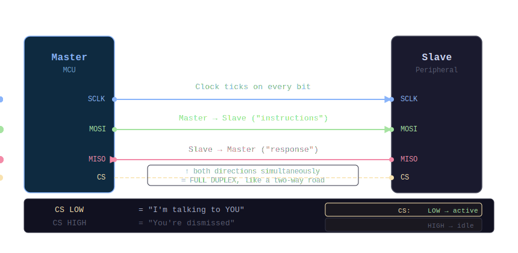

## The Core Embedded System Protocols

These protocols dictate how microcontrollers, sensors, and computers talk to one another.


## 1. UART — Universal Asynchronous Receiver-Transmitter

### Wiring Topology



```
  Device A                              Device B
  ┌──────────┐                          ┌──────────┐
  │       TX ├──────────────────────────┤ RX       │
  │          │                          │          │
  │       RX ├──────────────────────────┤ TX       │
  └──────────┘                          └──────────┘
   (e.g. MCU)      point-to-point         (e.g. GPS)
                    2 wires only
                    NO clock wire
```




### The Data Frame (What One Byte Looks Like on the Wire)



```
  Idle  START    D0    D1    D2    D3    D4    D5    D6    D7   PARITY STOP  Idle
  ───┐                                                                  ┌────────
     │  ┌───┐  ┌───┐        ┌───┐  ┌───┐        ┌───┐  ┌───┐  ┌───┐  │
     └──┘   └──┘   └────────┘   └──┘   └────────┘   └──┘   └──┘   └──┘
     │  │                  8 data bits                          │    │  │
     │  │                  (e.g. 0x55 = 0101 0101)             │    │  │
     │  │                                                       │    │  │
     │  └─ "Get ready!"                            error check ┘    └──┘
     │     Line goes LOW                                           "Done!"
     │     to signal start                                       Line goes HIGH

  Both sides MUST pre-agree on baud rate (e.g. `9600`, `115200` bps)
  No clock = any mismatch → garbled data ("framing error")
```




### How it Works

`UART` is one of the oldest and simplest methods. It uses just two wires: a transmit line (`TX`) and a receive line (`RX`). To connect two devices, the `TX` of the first device connects to the `RX` of the second, and vice versa. It is strictly a `point-to-point` connection — only two devices can talk to each other at once.

It is `asynchronous`, meaning there is no shared clock wire. Instead, both devices must agree beforehand on a specific speed, the `baud rate` (e.g., `9600 bits per second`). Because there is no clock to signal when a message starts, `UART` wraps data in a `start bit`, then `8 data bits`, an optional `parity bit`, and a `stop bit`.

**Where you will find it:** Arduino boards, `GPS` modules, and basic Bluetooth adapters.


## 2. SPI — Serial Peripheral Interface

### Wiring Topology



```
                         Master (MCU)
                    ┌─────────────────┐
                    │  SCLK  MOSI  MISO│
                    └───┬──────┬────┬──┘
                        │      │    │
          ┌─────────────┼──────┼────┼──────────────────┐
          │  SCLK       │ MOSI │  MISO                  │  shared bus
          │             │      │    │                   │
     ┌────┴───────┐ ┌───┴──────┴────┴───┐ ┌────────────┴───┐
     │  CS ◄──┐  │ │  CS ◄──┐          │ │  CS ◄──┐       │
     │        │  │ │        │           │ │        │       │
     │ Slave 1│  │ │ Slave 2│           │ │ Slave 3│       │
     └────────┘  │ └────────┘           │ └────────┘       │
                 │                      │                   │
             CS1 ┘                  CS2 ┘               CS3 ┘
          (unique per slave — "tap on the shoulder")
```




### Full-Duplex Data Flow



```
  Master     ──SCLK──►  Slave       Clock ticks on every bit

  Master     ──MOSI──►  Slave       Master → Slave  ("instructions")
             ◄─MISO──   Slave       Slave  → Master ("response")
                                    ↑ both directions simultaneously
                                    = FULL DUPLEX, like a two-way road

  CS LOW  = "I'm talking to YOU"
  CS HIGH = "You're dismissed"
```





### How it Works

Think of `SPI` as a boss (the "Master") managing one or more workers (the "Slaves"). It is incredibly fast and allows data to flow in both directions at the exact same time (`full-duplex`). A shared `SCLK` clock wire keeps all devices in perfect `synchronous` time.

Each Slave shares the same `MOSI` and `MISO` wires, but gets its own dedicated `Chip Select (CS)` wire — the Master pulls one `CS` LOW to address exactly one Slave. Adding more devices means one more `CS` wire per device.

**Where you will find it:** `SD` cards, `LCD` screens, and high-speed flash memory.


## 3. I2C — Inter-Integrated Circuit

### Wiring Topology (All Devices Share 2 Wires)



```
  VCC
   │
  ┌┴┐  ┌┴┐   pull-up resistors
  └┬┘  └┬┘   (hold lines HIGH when idle)
   │    │
   ├────┴──────────────────────────────── SDA (data)
   │
   └───────────────────────────────────── SCL (clock)
   │              │              │
┌──┴──────┐  ┌────┴────┐  ┌─────┴────┐
│ Master  │  │Slave    │  │ Slave    │  ... up to 127 devices
│ (MCU)   │  │Addr=0x48│  │Addr=0x3C │    on the same 2 wires
└─────────┘  └─────────┘  └──────────┘
              (temp sensor)  (OLED display)
```





### The "Group Chat" Address Protocol



```
  Master wants to talk to Slave at address 0x48:

  SDA: ─ START ─[ 0x48 ]─[ W ]─[ ACK ]─[ data... ]─[ ACK ]─ STOP ─
                    │       │       │
                    │       │       └─ Slave 0x48 pulls SDA low:
                    │       │            "I'm here! Go ahead."
                    │       └─ Write (0) or Read (1) flag
                    └─ 7-bit address broadcast to ALL devices
                         Only 0x48 responds — rest stay silent

  Half-duplex: only ONE direction at a time (like a walkie-talkie)
  Open-drain lines: devices can only PULL LOW, never push HIGH
  Pull-up resistors: naturally float back to HIGH when released
```




### How it Works

`I2C` is the smart middle ground for connecting many parts without creating a wire mess. Every Slave device has a unique `7-bit address`. The Master broadcasts an address on the shared `SDA` line — only the matching device responds with an `ACK` bit. It is `half-duplex` (one direction at a time), and devices use `open-drain` outputs with `pull-up resistors` to prevent short circuits.

**Where you will find it:** Temperature sensors, `OLED` displays, and gyroscopes.


## 4. CAN — Controller Area Network

### Wiring Topology (Two-Wire Differential Bus)



```
  Node 1        Node 2        Node 3        Node 4
  (Engine)      (Brakes)      (Airbag)      (Dashboard)
  ┌───────┐     ┌───────┐     ┌───────┐     ┌───────┐
  │  CAN  │     │  CAN  │     │  CAN  │     │  CAN  │
  │  ctrl │     │  ctrl │     │  ctrl │     │  ctrl │
  └───┬───┘     └───┬───┘     └───┬───┘     └───┬───┘
      │             │             │             │
──────┴─────────────┴─────────────┴─────────────┴────── CAN High
──────┬─────────────┬─────────────┬─────────────┬────── CAN Low
     [R]                                        [R]
  120Ω terminator                          120Ω terminator
  (prevents signal reflections)
```




### Differential Signalling — Noise Cancellation



```
  CAN High: ─────┐    ┌────┐    ┌─────
                 └────┘    └────┘
  CAN Low:  ──┐    ┌────┐    ┌──────
              └────┘    └────┘

  Receiver reads: CAN_High − CAN_Low = clean signal
  Noise spike hits BOTH wires equally → cancels out → data intact
```





### Arbitration — No Collision, No Data Loss



```
  Node A (ID=0x100) and Node B (ID=0x050) transmit simultaneously:

  Bit position:   10   9   8   7   6   5   4   3   2   1   0
  Node A sends:    1   0   0   0   0   0   0   0   0   0   0   (0x100)
  Node B sends:    0   0   0   0   0   0   0   0   0   0   0   (0x050)
                   ↑
                   First bit differs here
                   Node A reads the bus and sees a 0 (not its 1)
                   Node A immediately STOPS transmitting and waits
                   Node B wins — lower ID = higher priority
                   No data corrupted. No retransmission needed.
```




### How it Works

Invented by Bosch in 1983 to reduce copper wiring in cars. Instead of addressing devices, `CAN` addresses `messages` — each message has an `ID`, and every node decides whether it cares. Nodes share a `differential pair (CAN High / CAN Low)` which cancels electrical noise. If two nodes transmit simultaneously, the one with the `lower ID` wins arbitration bit-by-bit without corrupting data.

**Where you will find it:** Every modern car (`OBD-II` port), trucks, industrial robots, and medical equipment.


## 5. RS-232

### Voltage Levels — Why It Survives Noise



```
  UART / TTL Logic          RS-232 (the tough older brother)
  ─────────────────         ────────────────────────────────

  Logic 1 =  3.3V           Logic 1 =  +3V to +15V  (typically +12V)
  Logic 0 =  0V             Logic 0 =  −3V to −15V  (typically −12V)

  Noise immunity:           Noise immunity:
  ┌──── 3.3V (logic 1)      ┌──── +15V (logic 1)
  │                         │
  │  Any noise > 1.65V      │  Noise must be > 15V swing to flip a bit
  │  can flip the bit ←BAD  │  Virtually impossible in practice ←GOOD
  │                         │
  └──── 0V   (logic 0)      └──── −15V (logic 0)
                                    ↑
                                  27V total swing vs 3.3V = 8× tougher
```





### The MAX232 Translator



```
  MCU (3.3V/5V TTL)        MAX232 chip          RS-232 cable
  ┌────────────────┐       ┌──────────┐         ┌──────────────┐
  │                │       │          │         │              │
  │   TX (0–3.3V) ─┼──────►│ step up  ├────────►│ TX (+12/−12V)│
  │                │       │          │         │              │
  │   RX (0–3.3V) ◄┼───────┤ step down│◄────────┤ RX (+12/−12V)│
  │                │       │          │         │              │
  └────────────────┘       └──────────┘         └──────────────┘
                            "translator"
                    NEVER connect MCU directly to RS-232 — it will fry!
```




### How it Works

Think of `RS-232` as `UART's` tough older brother. It uses the same `asynchronous TX/RX` communication style, but survives harsh environments over long cables (`up to 50 feet`). Modern MCUs whisper at `0–3.3V`. `RS-232` shouts at `±15V`. A translator chip (`MAX232`) always sits between the MCU and the cable to safely convert voltages.

**Where you will find it:** Industrial machinery, `CNC` routers, factory automation, and legacy point-of-sale systems. `USB` replaced it for consumers, but it refuses to die in professional settings.


## 6. 1-Wire

### Wiring Topology — Power AND Data on One Wire



```
  Master (MCU)
  ┌──────────┐
  │          │        Single data wire
  │  GPIO ───┼────────────────────────────────────────────────
  │          │   │            │            │            │
  └──────────┘  ┌┴┐          ┌┴┐          ┌┴┐          ┌┴┐
               └┬┘          └┬┘          └┬┘          └┬┘
                │    4.7kΩ   │            │            │
               pull-up      GND          GND          GND
               to VCC
               ┌──────┐  ┌──────┐  ┌──────┐  ┌──────┐
               │DS18B20│  │DS18B20│  │DS18B20│  │DS18B20│
               │  ID:  │  │  ID:  │  │  ID:  │  │  ID:  │
               │ A3F2..│  │ 9B1C..│  │ E72A..│  │ 0048..│
               └───────┘  └───────┘  └───────┘  └───────┘
               (all share the exact same single wire)
```





### Parasitic Power — Energy Sipping



```
  Normal (idle):
  Wire ──── HIGH (VCC via pull-up) ───────────────────────────
                                    ↓ Slave capacitor charges up
                                   [C] ← stored energy

  Transmitting (wire pulled LOW briefly):
  Wire ──┐   LOW   ┌─ HIGH ──────────────────────────────────
         └─────────┘
         │  Slave survives on [C] stored charge during LOW pulse
         │  Master reads the pulse duration to decode bit value

  64-bit ROM ID burned at factory — mathematically unique, forever:
  ┌────────┬───────────────────────────────────┬────────┐
  │ 8-bit  │         48-bit serial number      │ 8-bit  │
  │ family │     (unique per device, ever)     │  CRC   │
  └────────┴───────────────────────────────────┴────────┘
```





### How it Works

`1-Wire` uses a single data wire for both power (`parasitic power`) and communication. Slave devices charge a tiny internal capacitor from the idle HIGH line, then survive on that stored energy while transmitting. Every device has a permanent `64-bit ID` burned at the factory — no address conflicts possible. The Master can `search` the bus to discover every connected device.

**Where you will find it:** `DS18B20` temperature sensors, laptop battery gauges, and `iButton` security keys. Unbeatable for running one cable to dozens of sensors across a large building.


## Protocol Comparison



```
  Protocol  Wires  Devices  Speed         Clock?   Duplex    Best For
  ────────  ─────  ───────  ────────────  ───────  ────────  ─────────────────────
  UART        2      2      115200 bps    None     Full      Simple point-to-point
  SPI         4+     N*     50+ MHz       Yes      Full      High-speed data (SD/LCD)
  I2C         2      127    400 kHz       Yes      Half      Many sensors, few pins
  CAN         2      127    1 Mbps        None     Half      Noisy environments, cars
  RS-232      2      2      115200 bps    None     Full      Long cables, industrial
  1-Wire      1      N      15 kbps       None     Half      Single cable, many sensors

  * SPI: requires 1 extra CS wire per additional device
```


This table provides a quick comparison of common hardware communication protocols used in embedded systems and industrial applications.

| Protocol | Wires | Devices | Speed | Clock? | Duplex | Best For |
| :--- | :--- | :--- | :--- | :--- | :--- | :--- |
| **UART** | 2 | 2 | 115200 bps | None | Full | Simple point-to-point |
| **SPI** | 4+ | N* | 50+ MHz | Yes | Full | High-speed data (SD/LCD) |
| **I2C** | 2 | 127 | 400 kHz | Yes | Half | Many sensors, few pins |
| **CAN** | 2 | 127 | 1 Mbps | None | Half | Noisy environments, cars |
| **RS-232** | 2 | 2 | 115200 bps | None | Full | Long cables, industrial |
| **1-Wire** | 1 | N | 15 kbps | None | Half | Single cable, many sensors |

\
***Note:** SPI requires 1 extra Chip Select (CS) wire per additional device added to the bus.*