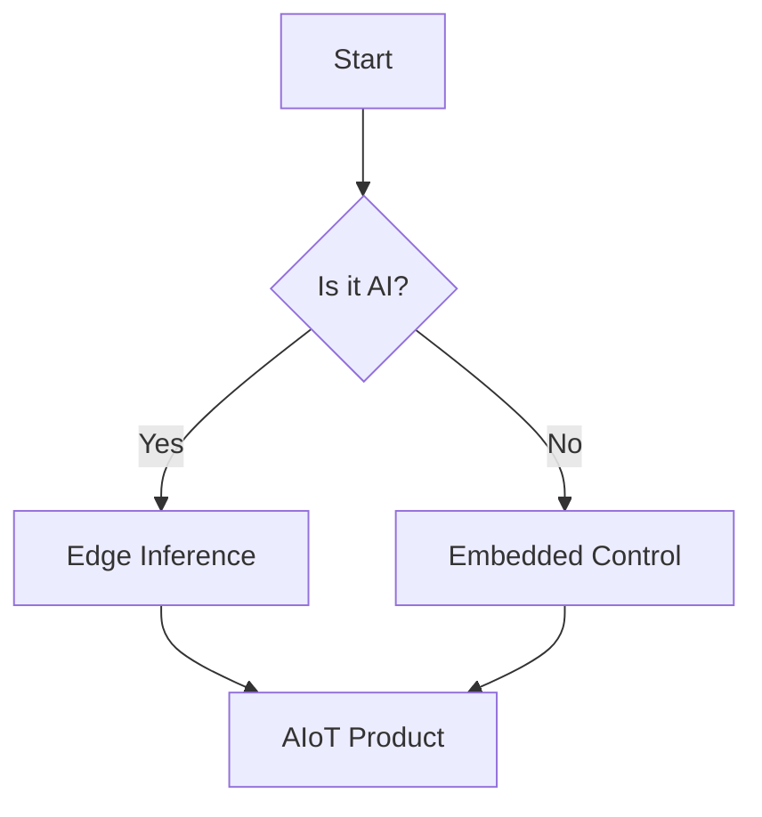

## 1. Syntax Highlighting

```python {filename="inference.py" hl_lines=[3]}
import torch

def predict(model, input):
    # This line is highlighted
    return model(input)
```

## 2. LaTeX Mathematical Equations

Example of an inline equation: \( E = mc^2 \).

Example of a block equation:
$$
\int_{a}^{b} x^2 dx = \frac{1}{3}(b^3 - a^3)
$$

## 3. Diagrams with Mermaid.js



## 4. Custom Shortcodes

### Callouts
{}
This is an information box. It uses a blue left border.
{}

{}
Be careful! This is a warning message.
{}

{}
Critical failure! Something went wrong.
{}

### Interactive Cards

  
  Learn about autonomous machines.
  
  
  Explore the future of connected intelligence.
  


### Collapsible Details
{}
Here is some hidden content that is only visible when expanded.
- Item 1
- Item 2
{}

## 5. Alerts

> [!NOTE]
> Useful information that users should know, even when skimming content.

> [!TIP]
> Helpful advice for doing things better or more easily.

> [!IMPORTANT]
> Key information users need to know to achieve their goal.

> [!WARNING]
> Urgent info that needs immediate user attention to avoid problems.

> [!CAUTION]
> Advises about risks or negative outcomes of certain actions.

## Images


